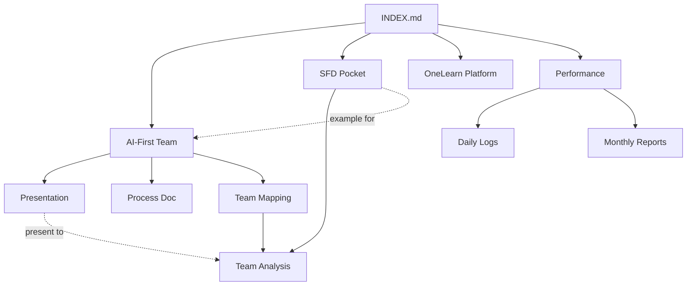

# 🔗 Cross-Project Links & References

**Purpose:** เชื่อมโยงเอกสารที่เกี่ยวข้องกันระหว่างโปรเจกต์  
**Last Updated:** 6 Feb 2026

---

## 🔄 Related Documents Map

### AI-First Team Process ←→ Team Analysis
```
[AI_FIRST_TEAM_PRESENTATION.html]
    ↳ อ้างอิงข้อมูลจาก → [TEAM_COMPOSITION.md]
    ↳ ใช้สื่อสารกับ → [profiles/Ta.md], [profiles/Off.md]
    ↳ นำไปสู่ → [performance/daily/] (tracking)
```

### SFD Pocket ←→ AI-First Team
```
[projects/sfd-pocket/ACTIVITY_LOG_2026-02-05.md]
    ↳ ใช้เป็นตัวอย่าง → [projects/ai-first-team/PROCESS_V01_TEAM_SETUP.md]
    ↳ Ta, Off ได้รับ AI training จาก → [projects/ai-first-team/]
```

### Performance ←→ All Projects
```
[performance/goals/PERFORMANCE_GOALS.md]
    ↳ วัดผลจาก → [projects/sfd-pocket/] (Delivery)
    ↳ วัดผลจาก → [projects/onelearn-platform/] (Technical)
    ↳ วัดผลจาก → [projects/ai-first-team/] (Team Leadership)
```

---

## 📂 Quick Access Links

### 🔴 High Priority (Today)

| เอกสาร | ที่อยู่ | เกี่ยวข้องกับ |
|--------|--------|--------------|
| 🎨 AI-First Presentation | [projects/ai-first-team/AI_FIRST_TEAM_PRESENTATION.html](./projects/ai-first-team/AI_FIRST_TEAM_PRESENTATION.html) | Team Meeting 10:00 AM |
| 📋 Process Setup Doc | [projects/ai-first-team/PROCESS_V01_TEAM_SETUP.md](./projects/ai-first-team/PROCESS_V01_TEAM_SETUP.md) | Implementation guide |

### 🟡 Reference Documents

| หัวข้อ | เอกสารหลัก | เอกสารอ้างอิง |
|--------|-----------|--------------|
| Team Structure | [TEAM_COMPOSITION.md](./projects/team-analysis/TEAM_COMPOSITION.md) | [MEMORY.md](./MEMORY.md) |
| Creative Types | [projects/team-analysis/](./projects/team-analysis/) | Adobe Creative Types framework |
| SFD Progress | [projects/sfd-pocket/ACTIVITY_LOG_2026-02-05.md](./projects/sfd-pocket/ACTIVITY_LOG_2026-02-05.md) | [MONTHLY_TRACKER.md](./performance/monthly/2026-02.md) |

---

## 🎯 Context-Aware Links

### สำหรับ Developer (Ta, Off)

**หากคุณกำลังอ่าน:**
- [Systematic AI Development](./projects/ai-first-team/PROCESS_V01_TEAM_SETUP.md#for-developers)
- ↳ ดูตัวอย่างที่ → [SFD Pocket การใช้ AI](./projects/sfd-pocket/ACTIVITY_LOG_2026-02-05.md#ai-usage)
- ↳ เกณฑ์ประเมิน → [Performance Goals](./performance/goals/PERFORMANCE_GOALS.md#technical-delivery)

### สำหรับ PM (Ploy, Pam, Alok)

**หากคุณกำลังอ่าน:**
- [Sprint Planning with AI](./projects/ai-first-team/PROCESS_V01_TEAM_SETUP.md#for-pm)
- ↳ ดูทีม composition → [Team Analysis](./projects/team-analysis/)
- ↳ ติดตาม progress → [Performance Dashboard](./INDEX.md#project-status-dashboard)

### สำหรับ Director/CTO (Games, Pei)

**หากคุณกำลังอ่าน:**
- [Strategic Overview](./INDEX.md)
- ↳ Trial Period Status → [performance/](./performance/)
- ↳ Team Capability → [Team Analysis](./projects/team-analysis/)

---

## 📝 Document Dependencies



---

## 🔍 Search Guide

**หากต้องการหา:**

| ค้นหา | ไปที่ | คำสั่ง |
|-------|-------|--------|
| ข้อมูลทีมล่าสุด | [MEMORY.md](./MEMORY.md) | `grep -n "Team" MEMORY.md` |
| Activity วันนี้ | [performance/daily/](./performance/daily/) | `ls -lt performance/daily/` |
| Presentation สำหรับประชุม | [projects/ai-first-team/](./projects/ai-first-team/) | `open AI_FIRST_TEAM_PRESENTATION.html` |
| โค้ด SFD Pocket | `~/repos/sfd-pocket-poc/` | `cd ~/repos/sfd-pocket-poc` |

---

## ⚡ Shortcut Commands

```bash
# ไปที่โปรเจกต์ AI-First
cd ~/.openclaw/workspace/projects/ai-first-team

# ดู activity ล่าสุด
ls -lt ~/.openclaw/workspace/performance/daily/

# ค้นหาเอกสารที่เกี่ยวข้องกับ "team"
grep -r "team" ~/.openclaw/workspace/projects/ --include="*.md" | head -10

# เปิด presentation
open ~/.openclaw/workspace/projects/ai-first-team/AI_FIRST_TEAM_PRESENTATION.html
```

---

**หมายเหตุ:** เอกสารนี้จะอัปเดตอัตโนมัติเมื่อมีการเพิ่มโปรเจกต์ใหม่  
**หากพบลิงก์เสีย:** แจ้ง Busaba ให้อัปเดต 🌸
