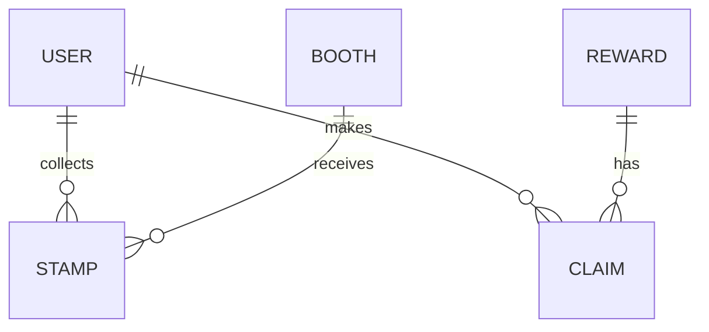

# Data Model

## SFD Pocket - Database Schema Documentation

**Version:** 0.3.0  
**Database:** SQLite (Prisma ORM)  
**Last Updated:** 2026-02-06

---

## Table of Contents

1. [Overview](#1-overview)
2. [Entity Descriptions](#2-entity-descriptions)
3. [Schema Definition](#3-schema-definition)
4. [Relationships](#4-relationships)
5. [Indexes](#5-indexes)
6. [Migrations](#6-migrations)

---

## 1. Overview

The SFD Pocket database uses SQLite with Prisma ORM for type-safe database access. The schema is designed to be simple yet extensible, supporting future migration to PostgreSQL.

### 1.1 Design Principles

- **Simplicity:** Minimal tables, clear relationships
- **Extensibility:** Easy to add fields for future features
- **Performance:** Proper indexing on foreign keys and lookups
- **Integrity:** Foreign key constraints and unique indexes

### 1.2 Entity Overview



---

## 2. Entity Descriptions

### 2.1 User

Stores registered users of the system.

| Attribute | Type | Description |
|-----------|------|-------------|
| id | UUID | Primary identifier |
| email | String | Unique email address (login identifier) |
| name | String | Optional display name |
| password | String | Optional hashed password |
| createdAt | DateTime | Registration timestamp |
| updatedAt | DateTime | Last modification timestamp |

**Constraints:**
- Email must be unique
- Password is hashed with bcrypt (if provided)

**Relationships:**
- One-to-Many with Stamp
- One-to-Many with Claim

---

### 2.2 Booth

Represents event booths that users can collect stamps from.

| Attribute | Type | Description |
|-----------|------|-------------|
| id | UUID | Primary identifier |
| slug | String | URL-friendly unique identifier |
| name | String | Display name (English) |
| nameTh | String | Thai display name |
| icon | String | Emoji/icon representation |
| description | String | Booth description |
| isActive | Boolean | Whether booth is active |
| createdAt | DateTime | Creation timestamp |
| updatedAt | DateTime | Last modification timestamp |

**Constraints:**
- Slug must be unique
- Slug should be URL-safe (lowercase, no spaces)

**Relationships:**
- One-to-Many with Stamp

---

### 2.3 Stamp

Junction table representing a user collecting a stamp at a booth.

| Attribute | Type | Description |
|-----------|------|-------------|
| id | UUID | Primary identifier |
| userId | UUID | Reference to User |
| boothId | UUID | Reference to Booth |
| createdAt | DateTime | When stamp was collected |

**Constraints:**
- Composite unique constraint: (userId, boothId)
- Foreign key to User
- Foreign key to Booth

**Relationships:**
- Many-to-One with User
- Many-to-One with Booth

---

### 2.4 Reward

Defines rewards that users can claim after collecting enough stamps.

| Attribute | Type | Description |
|-----------|------|-------------|
| id | UUID | Primary identifier |
| name | String | Reward name |
| description | String | Reward description |
| requiredStamps | Int | Number of stamps needed to claim |
| quantity | Int | Available quantity (-1 for unlimited) |
| isActive | Boolean | Whether reward is active |
| createdAt | DateTime | Creation timestamp |
| updatedAt | DateTime | Last modification timestamp |

**Constraints:**
- requiredStamps must be ≥ 0
- quantity must be ≥ -1

**Relationships:**
- One-to-Many with Claim

---

### 2.5 Claim

Records a user's claim for a reward.

| Attribute | Type | Description |
|-----------|------|-------------|
| id | UUID | Primary identifier |
| userId | UUID | Reference to User |
| rewardId | UUID | Reference to Reward |
| status | String | pending, approved, or rejected |
| claimedAt | DateTime | When claim was made |

**Constraints:**
- Foreign key to User
- Foreign key to Reward

**Relationships:**
- Many-to-One with User
- Many-to-One with Reward

---

## 3. Schema Definition

### 3.1 Prisma Schema

```prisma
generator client {
  provider = "prisma-client-js"
}

datasource db {
  provider = "sqlite"
  url      = env("DATABASE_URL")
}

model User {
  id        String   @id @default(uuid())
  email     String   @unique
  name      String?
  password  String?
  createdAt DateTime @default(now())
  updatedAt DateTime @updatedAt
  
  stamps    Stamp[]
  claims    Claim[]
}

model Booth {
  id          String   @id @default(uuid())
  slug        String   @unique
  name        String
  nameTh      String?
  icon        String?
  description String?
  isActive    Boolean  @default(true)
  createdAt   DateTime @default(now())
  updatedAt   DateTime @updatedAt
  
  stamps      Stamp[]
}

model Stamp {
  id        String   @id @default(uuid())
  userId    String
  boothId   String
  createdAt DateTime @default(now())
  
  user      User     @relation(fields: [userId], references: [id], onDelete: Cascade)
  booth     Booth    @relation(fields: [boothId], references: [id], onDelete: Cascade)
  
  @@unique([userId, boothId])
  @@index([userId])
  @@index([boothId])
}

model Reward {
  id             String   @id @default(uuid())
  name           String
  description    String?
  requiredStamps Int      @default(7)
  quantity       Int      @default(0)
  isActive       Boolean  @default(true)
  createdAt      DateTime @default(now())
  updatedAt      DateTime @updatedAt
  
  claims         Claim[]
}

model Claim {
  id        String   @id @default(uuid())
  userId    String
  rewardId  String
  status    String   @default("pending")
  claimedAt DateTime @default(now())
  
  user      User     @relation(fields: [userId], references: [id], onDelete: Cascade)
  reward    Reward   @relation(fields: [rewardId], references: [id], onDelete: Cascade)
  
  @@index([userId])
  @@index([rewardId])
  @@index([status])
}
```

### 3.2 SQL DDL (SQLite)

```sql
-- User Table
CREATE TABLE "User" (
    "id" TEXT NOT NULL PRIMARY KEY,
    "email" TEXT NOT NULL,
    "name" TEXT,
    "password" TEXT,
    "createdAt" DATETIME NOT NULL DEFAULT CURRENT_TIMESTAMP,
    "updatedAt" DATETIME NOT NULL
);

CREATE UNIQUE INDEX "User_email_key" ON "User"("email");

-- Booth Table
CREATE TABLE "Booth" (
    "id" TEXT NOT NULL PRIMARY KEY,
    "slug" TEXT NOT NULL,
    "name" TEXT NOT NULL,
    "nameTh" TEXT,
    "icon" TEXT,
    "description" TEXT,
    "isActive" BOOLEAN NOT NULL DEFAULT true,
    "createdAt" DATETIME NOT NULL DEFAULT CURRENT_TIMESTAMP,
    "updatedAt" DATETIME NOT NULL
);

CREATE UNIQUE INDEX "Booth_slug_key" ON "Booth"("slug");

-- Stamp Table
CREATE TABLE "Stamp" (
    "id" TEXT NOT NULL PRIMARY KEY,
    "userId" TEXT NOT NULL,
    "boothId" TEXT NOT NULL,
    "createdAt" DATETIME NOT NULL DEFAULT CURRENT_TIMESTAMP,
    CONSTRAINT "Stamp_userId_fkey" FOREIGN KEY ("userId") REFERENCES "User" ("id") ON DELETE CASCADE ON UPDATE CASCADE,
    CONSTRAINT "Stamp_boothId_fkey" FOREIGN KEY ("boothId") REFERENCES "Booth" ("id") ON DELETE CASCADE ON UPDATE CASCADE
);

CREATE UNIQUE INDEX "Stamp_userId_boothId_key" ON "Stamp"("userId", "boothId");
CREATE INDEX "Stamp_userId_idx" ON "Stamp"("userId");
CREATE INDEX "Stamp_boothId_idx" ON "Stamp"("boothId");

-- Reward Table
CREATE TABLE "Reward" (
    "id" TEXT NOT NULL PRIMARY KEY,
    "name" TEXT NOT NULL,
    "description" TEXT,
    "requiredStamps" INTEGER NOT NULL DEFAULT 7,
    "quantity" INTEGER NOT NULL DEFAULT 0,
    "isActive" BOOLEAN NOT NULL DEFAULT true,
    "createdAt" DATETIME NOT NULL DEFAULT CURRENT_TIMESTAMP,
    "updatedAt" DATETIME NOT NULL
);

-- Claim Table
CREATE TABLE "Claim" (
    "id" TEXT NOT NULL PRIMARY KEY,
    "userId" TEXT NOT NULL,
    "rewardId" TEXT NOT NULL,
    "status" TEXT NOT NULL DEFAULT 'pending',
    "claimedAt" DATETIME NOT NULL DEFAULT CURRENT_TIMESTAMP,
    CONSTRAINT "Claim_userId_fkey" FOREIGN KEY ("userId") REFERENCES "User" ("id") ON DELETE CASCADE ON UPDATE CASCADE,
    CONSTRAINT "Claim_rewardId_fkey" FOREIGN KEY ("rewardId") REFERENCES "Reward" ("id") ON DELETE CASCADE ON UPDATE CASCADE
);

CREATE INDEX "Claim_userId_idx" ON "Claim"("userId");
CREATE INDEX "Claim_rewardId_idx" ON "Claim"("rewardId");
CREATE INDEX "Claim_status_idx" ON "Claim"("status");
```

---

## 4. Relationships

### 4.1 Relationship Diagram

```
┌─────────────┐       ┌─────────────┐       ┌─────────────┐
│    User     │       │    Stamp    │       │    Booth    │
├─────────────┤       ├─────────────┤       ├─────────────┤
│ id (PK)     │◄──────┤ userId (FK) │       │ id (PK)     │
│ email       │   1:M │ boothId(FK) ├──────►│ slug        │
│ name        │       │ createdAt   │   M:1 │ name        │
└─────────────┘       └─────────────┘       └─────────────┘
       │
       │ 1:M
       ▼
┌─────────────┐       ┌─────────────┐
│    Claim    │       │   Reward    │
├─────────────┤       ├─────────────┤
│ id (PK)     │       │ id (PK)     │
│ userId (FK) │   M:1 │ name        │
│ rewardId(FK)├──────►│ requiredStamps
│ status      │       │ quantity    │
└─────────────┘       └─────────────┘
```

### 4.2 Cascade Rules

| Parent | Child | On Delete | Behavior |
|--------|-------|-----------|----------|
| User | Stamp | CASCADE | Delete user's stamps |
| User | Claim | CASCADE | Delete user's claims |
| Booth | Stamp | CASCADE | Delete booth's stamps |
| Reward | Claim | CASCADE | Delete reward's claims |

---

## 5. Indexes

### 5.1 Unique Indexes

| Table | Fields | Purpose |
|-------|--------|---------|
| User | email | Prevent duplicate registrations |
| Booth | slug | Ensure URL uniqueness |
| Stamp | userId + boothId | Prevent duplicate stamps |

### 5.2 Performance Indexes

| Table | Field | Purpose |
|-------|-------|---------|
| Stamp | userId | Fast lookup of user's stamps |
| Stamp | boothId | Fast lookup of booth's stamps |
| Claim | userId | Fast lookup of user's claims |
| Claim | rewardId | Fast lookup of reward's claims |
| Claim | status | Fast filtering by status |

---

## 6. Migrations

### 6.1 Current Migration

**Migration:** `20250206000000_initial`

```sql
-- This is your Prisma migration file
-- Created: 2026-02-06

-- CreateTable User
-- CreateTable Booth
-- CreateTable Stamp
-- CreateTable Reward
-- CreateTable Claim
-- CreateIndex on all tables
```

### 6.2 Migration History

| Version | Date | Description |
|---------|------|-------------|
| 0.1.0 | 2026-02-03 | Initial schema with User, Booth, Stamp |
| 0.2.0 | 2026-02-04 | Added Reward and Claim |
| 0.3.0 | 2026-02-05 | Added admin fields, indexes |

### 6.3 Future Migrations

**Planned for v0.4.0:**
- Add `settings` table for configuration
- Add `auditLog` table for admin actions
- Add `session` table for server-side sessions

### 6.4 Migration Commands

```bash
# Create new migration
npx prisma migrate dev --name migration_name

# Apply migrations
npx prisma migrate deploy

# Generate client
npx prisma generate

# Reset database
npx prisma migrate reset

# View migration status
npx prisma migrate status
```

---

*End of Data Model Document*
