# Sequence Diagrams

## SFD Pocket - System Interaction Flows

**Version:** 0.3.0  
**Date:** 2026-02-06

---

## Table of Contents

1. [Authentication Flows](#1-authentication-flows)
2. [Stamp Collection Flows](#2-stamp-collection-flows)
3. [Reward Claim Flows](#3-reward-claim-flows)
4. [Admin Portal Flows](#4-admin-portal-flows)

---

## 1. Authentication Flows

### 1.1 User Registration/Login

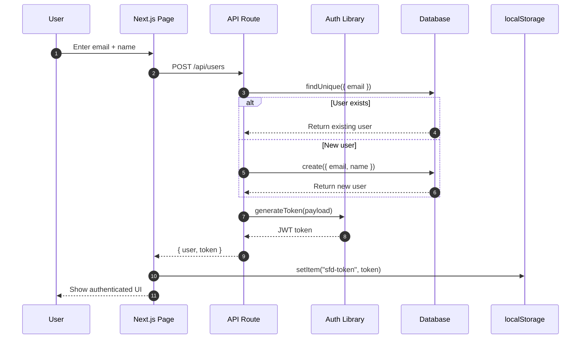
```mermaid
sequenceDiagram
    autonumber
    participant U as User
    participant P as Next.js Page
    participant API as API Route
    participant Auth as Auth Library
    participant DB as Database
    participant LS as localStorage

    U->>P: Enter email + name
    P->>API: POST /api/users
    
    API->>DB: findUnique({ email })
    
    alt User exists
        DB-->>API: Return existing user
    else New user
        API->>DB: create({ email, name })
        DB-->>API: Return new user
    end
    
    API->>Auth: generateToken(payload)
    Auth-->>API: JWT token
    API-->>P: { user, token }
    
    P->>LS: setItem("sfd-token", token)
    P-->>U: Show authenticated UI
```

**Description:**
- Users can register with just email (and optional name)
- If email exists, returns existing user with new token
- Token is stored in localStorage for persistence
- Token expires after 7 days

---

### 1.2 Token Validation

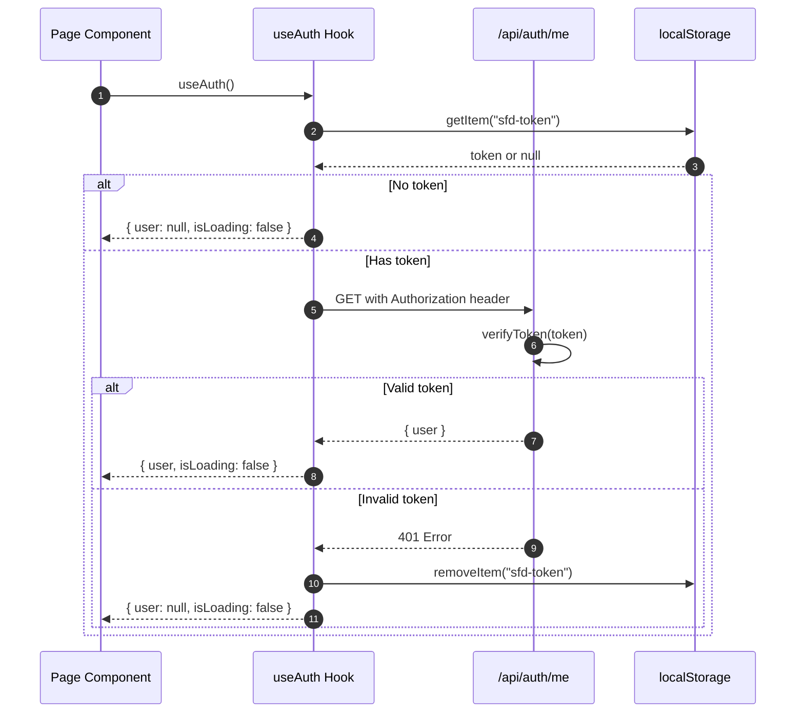
```mermaid
sequenceDiagram
    autonumber
    participant P as Page Component
    participant Hook as useAuth Hook
    participant API as /api/auth/me
    participant LS as localStorage

    P->>Hook: useAuth()
    Hook->>LS: getItem("sfd-token")
    LS-->>Hook: token or null
    
    alt No token
        Hook-->>P: { user: null, isLoading: false }
    else Has token
        Hook->>API: GET with Authorization header
        API->>API: verifyToken(token)
        
        alt Valid token
            API-->>Hook: { user }
            Hook-->>P: { user, isLoading: false }
        else Invalid token
            API-->>Hook: 401 Error
            Hook->>LS: removeItem("sfd-token")
            Hook-->>P: { user: null, isLoading: false }
        end
    end
```

**Description:**
- On page load, useAuth hook validates stored token
- If token is invalid/expired, it's removed and user is logged out
- This ensures secure session management

---

### 1.3 Admin Login

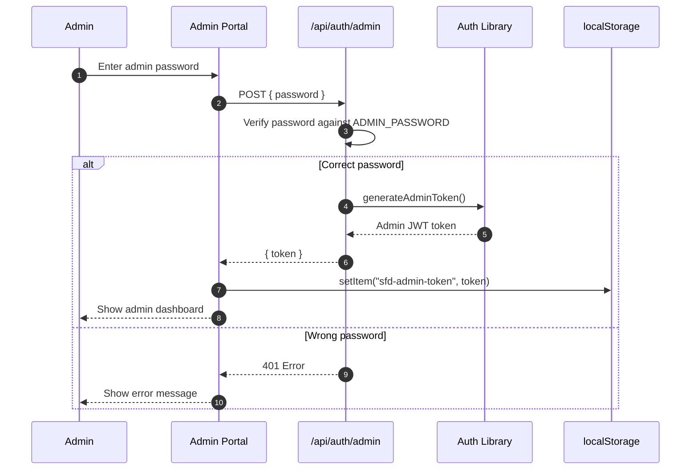
```mermaid
sequenceDiagram
    autonumber
    participant A as Admin
    participant P as Admin Portal
    participant API as /api/auth/admin
    participant Auth as Auth Library
    participant LS as localStorage

    A->>P: Enter admin password
    P->>API: POST { password }
    
    API->>API: Verify password against ADMIN_PASSWORD
    
    alt Correct password
        API->>Auth: generateAdminToken()
        Auth-->>API: Admin JWT token
        API-->>P: { token }
        P->>LS: setItem("sfd-admin-token", token)
        P-->>A: Show admin dashboard
    else Wrong password
        API-->>P: 401 Error
        P-->>A: Show error message
    end
```

**Description:**
- Admin uses shared password to access portal
- Admin token is separate from user token
- Admin token expires after 24 hours
- Admin token has `isAdmin: true` claim

---

## 2. Stamp Collection Flows

### 2.1 QR Code Scanning

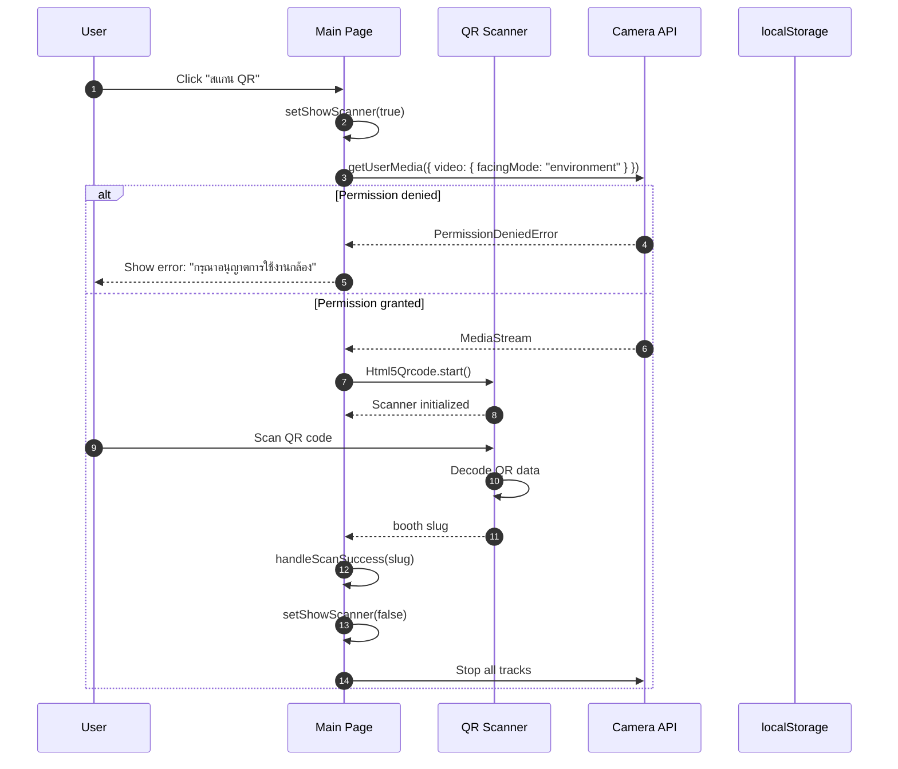
```mermaid
sequenceDiagram
    autonumber
    participant U as User
    participant P as Main Page
    participant S as QR Scanner
    participant Cam as Camera API
    participant LS as localStorage

    U->>P: Click "สแกน QR"
    P->>P: setShowScanner(true)
    
    P->>Cam: getUserMedia({ video: { facingMode: "environment" } })
    
    alt Permission denied
        Cam-->>P: PermissionDeniedError
        P-->>U: Show error: "กรุณาอนุญาตการใช้งานกล้อง"
    else Permission granted
        Cam-->>P: MediaStream
        P->>S: Html5Qrcode.start()
        S-->>P: Scanner initialized
        
        U->>S: Scan QR code
        S->>S: Decode QR data
        S-->>P: booth slug
        
        P->>P: handleScanSuccess(slug)
        P->>P: setShowScanner(false)
        P->>Cam: Stop all tracks
    end
```

**Description:**
- Scanner uses html5-qrcode library
- Requests back camera (environment facing)
- Handles permission errors gracefully
- Supports camera switching on multi-camera devices

---

### 2.2 Stamp Collection

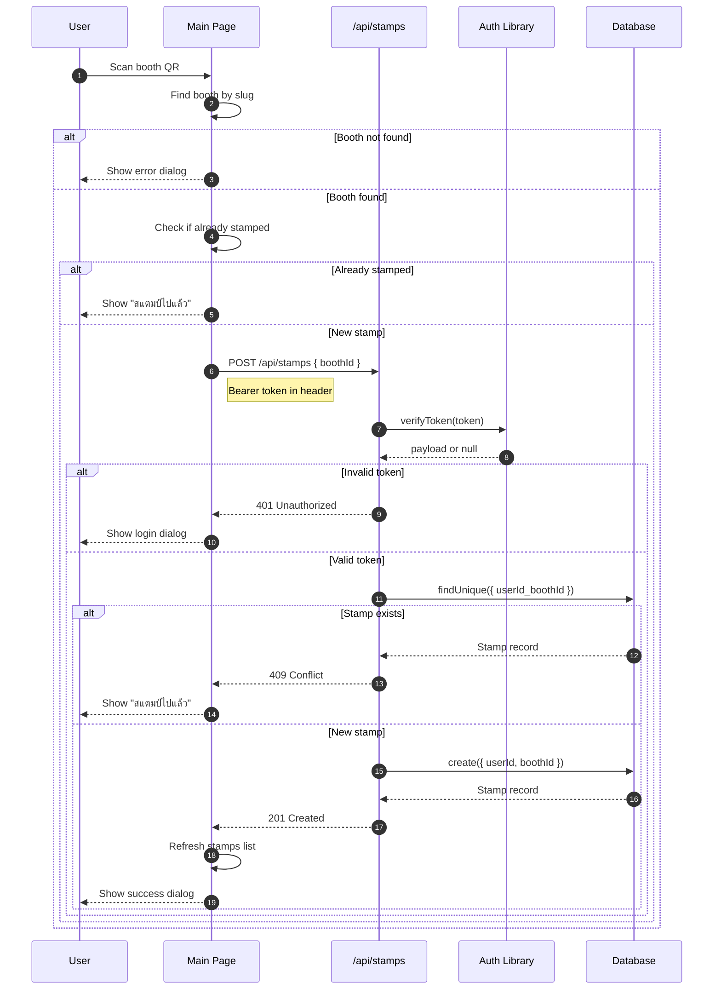
```mermaid
sequenceDiagram
    autonumber
    participant U as User
    participant P as Main Page
    participant API as /api/stamps
    participant Auth as Auth Library
    participant DB as Database

    U->>P: Scan booth QR
    P->>P: Find booth by slug
    
    alt Booth not found
        P-->>U: Show error dialog
    else Booth found
        P->>P: Check if already stamped
        
        alt Already stamped
            P-->>U: Show "สแตมป์ไปแล้ว"
        else New stamp
            P->>API: POST /api/stamps { boothId }
            Note right of P: Bearer token in header
            
            API->>Auth: verifyToken(token)
            Auth-->>API: payload or null
            
            alt Invalid token
                API-->>P: 401 Unauthorized
                P-->>U: Show login dialog
            else Valid token
                API->>DB: findUnique({ userId_boothId })
                
                alt Stamp exists
                    DB-->>API: Stamp record
                    API-->>P: 409 Conflict
                    P-->>U: Show "สแตมป์ไปแล้ว"
                else New stamp
                    API->>DB: create({ userId, boothId })
                    DB-->>API: Stamp record
                    API-->>P: 201 Created
                    P->>P: Refresh stamps list
                    P-->>U: Show success dialog
                end
            end
        end
    end
```

**Description:**
- Checks for existing stamp before creating
- Uses composite unique constraint to prevent duplicates
- Returns appropriate HTTP status codes
- Updates UI immediately after success

---

### 2.3 Progress Calculation

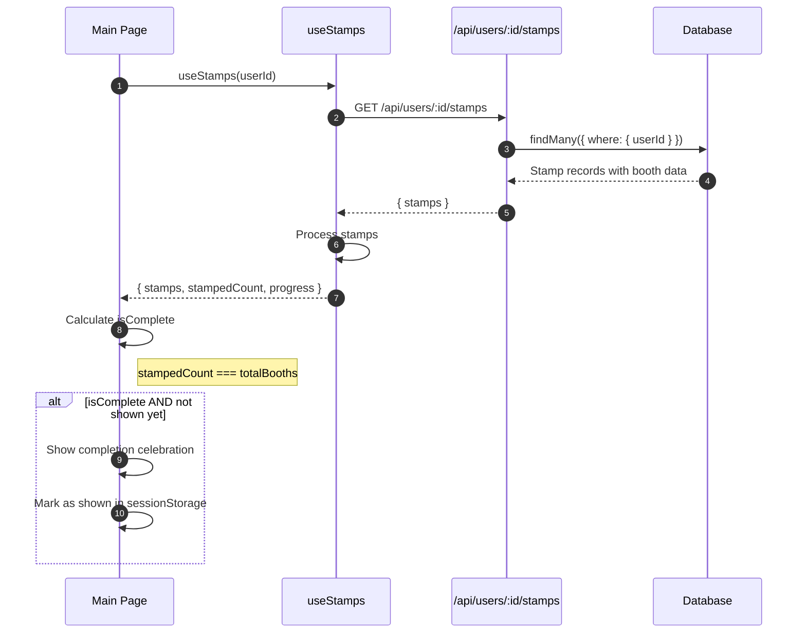
```mermaid
sequenceDiagram
    autonumber
    participant P as Main Page
    participant Hook as useStamps
    participant API as /api/users/:id/stamps
    participant DB as Database

    P->>Hook: useStamps(userId)
    Hook->>API: GET /api/users/:id/stamps
    
    API->>DB: findMany({ where: { userId } })
    DB-->>API: Stamp records with booth data
    API-->>Hook: { stamps }
    
    Hook->>Hook: Process stamps
    Hook-->>P: { stamps, stampedCount, progress }
    
    P->>P: Calculate isComplete
    Note right of P: stampedCount === totalBooths
    
    alt isComplete AND not shown yet
        P->>P: Show completion celebration
        P->>P: Mark as shown in sessionStorage
    end
```

**Description:**
- Progress calculated from user's stamps vs active booths
- Completion celebration only shows once per session
- Real-time updates after each stamp collection

---

## 3. Reward Claim Flows

### 3.1 View Rewards

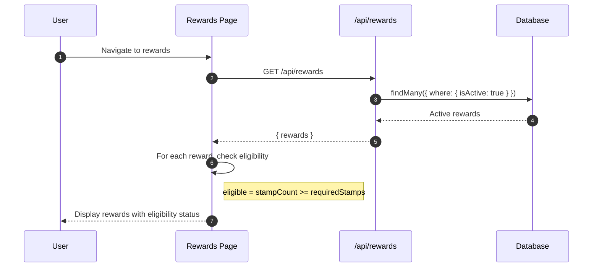
```mermaid
sequenceDiagram
    autonumber
    participant U as User
    participant P as Rewards Page
    participant API as /api/rewards
    participant DB as Database

    U->>P: Navigate to rewards
    P->>API: GET /api/rewards
    
    API->>DB: findMany({ where: { isActive: true } })
    DB-->>API: Active rewards
    API-->>P: { rewards }
    
    P->>P: For each reward, check eligibility
    Note right of P: eligible = stampCount >= requiredStamps
    
    P-->>U: Display rewards with eligibility status
```

---

### 3.2 Claim Reward

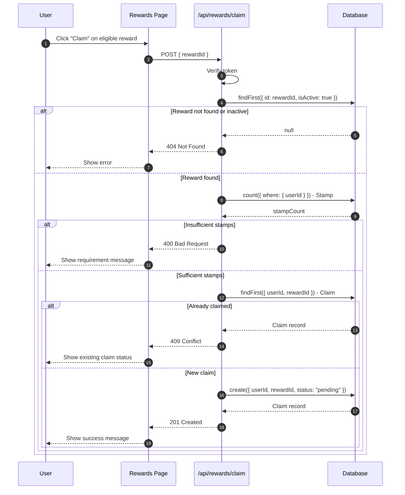
```mermaid
sequenceDiagram
    autonumber
    participant U as User
    participant P as Rewards Page
    participant API as /api/rewards/claim
    participant DB as Database

    U->>P: Click "Claim" on eligible reward
    P->>API: POST { rewardId }
    
    API->>API: Verify token
    API->>DB: findFirst({ id: rewardId, isActive: true })
    
    alt Reward not found or inactive
        DB-->>API: null
        API-->>P: 404 Not Found
        P-->>U: Show error
    else Reward found
        API->>DB: count({ where: { userId } }) - Stamp
        DB-->>API: stampCount
        
        alt Insufficient stamps
            API-->>P: 400 Bad Request
            P-->>U: Show requirement message
        else Sufficient stamps
            API->>DB: findFirst({ userId, rewardId }) - Claim
            
            alt Already claimed
                DB-->>API: Claim record
                API-->>P: 409 Conflict
                P-->>U: Show existing claim status
            else New claim
                API->>DB: create({ userId, rewardId, status: "pending" })
                DB-->>API: Claim record
                API-->>P: 201 Created
                P-->>U: Show success message
            end
        end
    end
```

**Description:**
- Claims are created with "pending" status
- Admin must approve/reject claims
- Duplicate claims are prevented

---

## 4. Admin Portal Flows

### 4.1 Dashboard Statistics

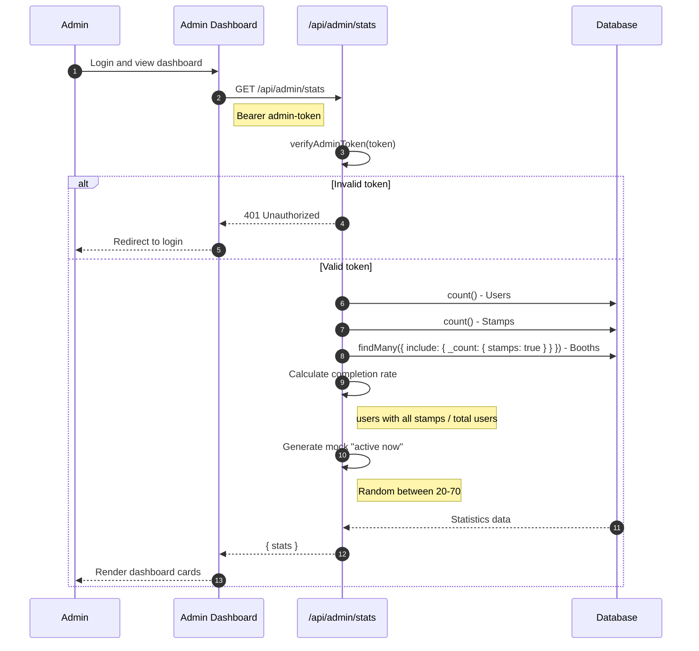
```mermaid
sequenceDiagram
    autonumber
    participant A as Admin
    participant P as Admin Dashboard
    participant API as /api/admin/stats
    participant DB as Database

    A->>P: Login and view dashboard
    P->>API: GET /api/admin/stats
    Note right of P: Bearer admin-token
    
    API->>API: verifyAdminToken(token)
    
    alt Invalid token
        API-->>P: 401 Unauthorized
        P-->>A: Redirect to login
    else Valid token
        API->>DB: count() - Users
        API->>DB: count() - Stamps
        API->>DB: findMany({ include: { _count: { stamps: true } } }) - Booths
        
        API->>API: Calculate completion rate
        Note right of API: users with all stamps / total users
        
        API->>API: Generate mock "active now"
        Note right of API: Random between 20-70
        
        DB-->>API: Statistics data
        API-->>P: { stats }
        P-->>A: Render dashboard cards
    end
```

---

### 4.2 Booth Management

#### Create Booth

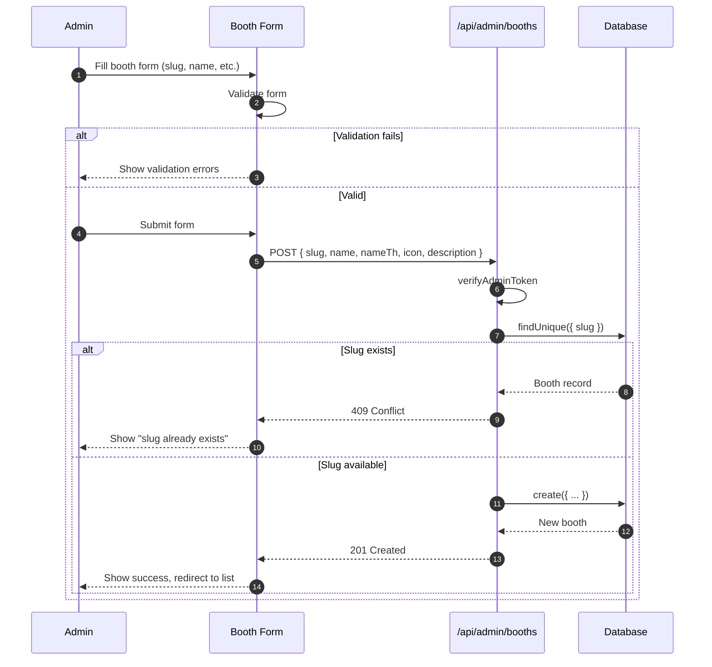
```mermaid
sequenceDiagram
    autonumber
    participant A as Admin
    participant P as Booth Form
    participant API as /api/admin/booths
    participant DB as Database

    A->>P: Fill booth form (slug, name, etc.)
    P->>P: Validate form
    
    alt Validation fails
        P-->>A: Show validation errors
    else Valid
        A->>P: Submit form
        P->>API: POST { slug, name, nameTh, icon, description }
        
        API->>API: verifyAdminToken
        API->>DB: findUnique({ slug })
        
        alt Slug exists
            DB-->>API: Booth record
            API-->>P: 409 Conflict
            P-->>A: Show "slug already exists"
        else Slug available
            API->>DB: create({ ... })
            DB-->>API: New booth
            API-->>P: 201 Created
            P-->>A: Show success, redirect to list
        end
    end
```

#### Delete Booth

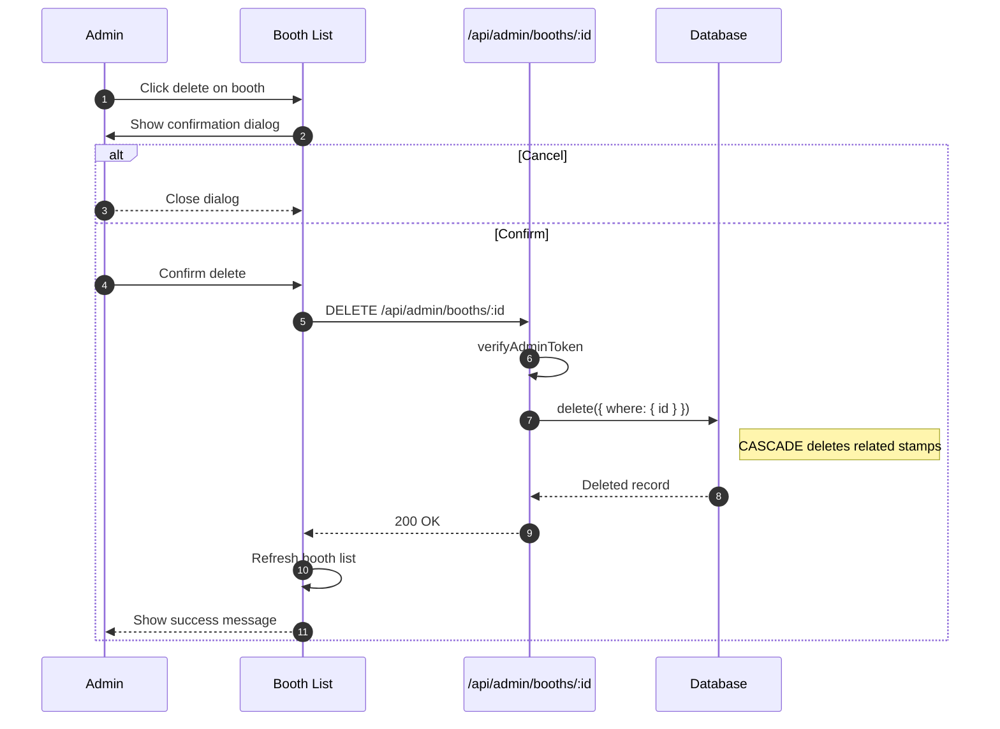
```mermaid
sequenceDiagram
    autonumber
    participant A as Admin
    participant P as Booth List
    participant API as /api/admin/booths/:id
    participant DB as Database

    A->>P: Click delete on booth
    P->>A: Show confirmation dialog
    
    alt Cancel
        A-->>P: Close dialog
    else Confirm
        A->>P: Confirm delete
        P->>API: DELETE /api/admin/booths/:id
        
        API->>API: verifyAdminToken
        API->>DB: delete({ where: { id } })
        
        Note right of DB: CASCADE deletes related stamps
        
        DB-->>API: Deleted record
        API-->>P: 200 OK
        P->>P: Refresh booth list
        P-->>A: Show success message
    end
```

---

### 4.3 User Management

#### Export Users to CSV

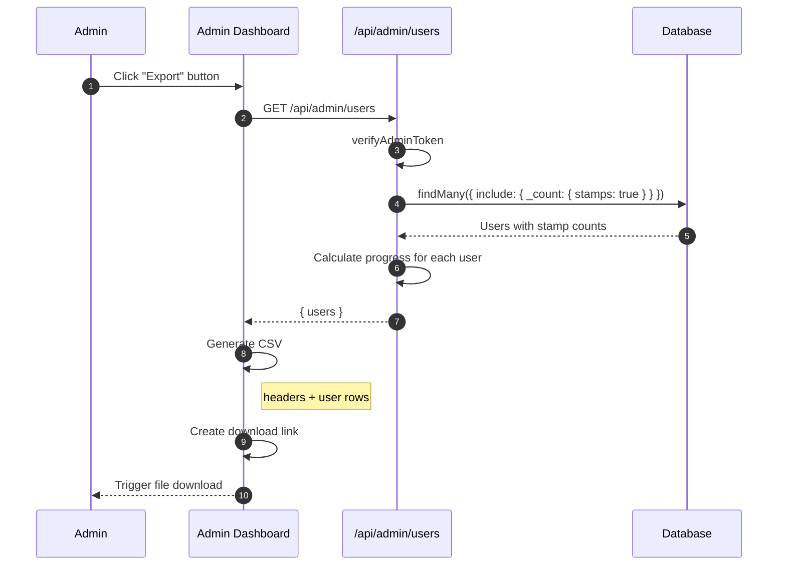
```mermaid
sequenceDiagram
    autonumber
    participant A as Admin
    participant P as Admin Dashboard
    participant API as /api/admin/users
    participant DB as Database

    A->>P: Click "Export" button
    P->>API: GET /api/admin/users
    
    API->>API: verifyAdminToken
    API->>DB: findMany({ include: { _count: { stamps: true } } })
    DB-->>API: Users with stamp counts
    
    API->>API: Calculate progress for each user
    API-->>P: { users }
    
    P->>P: Generate CSV
    Note right of P: headers + user rows
    
    P->>P: Create download link
    P-->>A: Trigger file download
```

---

### 4.4 Claim Management

#### Update Claim Status

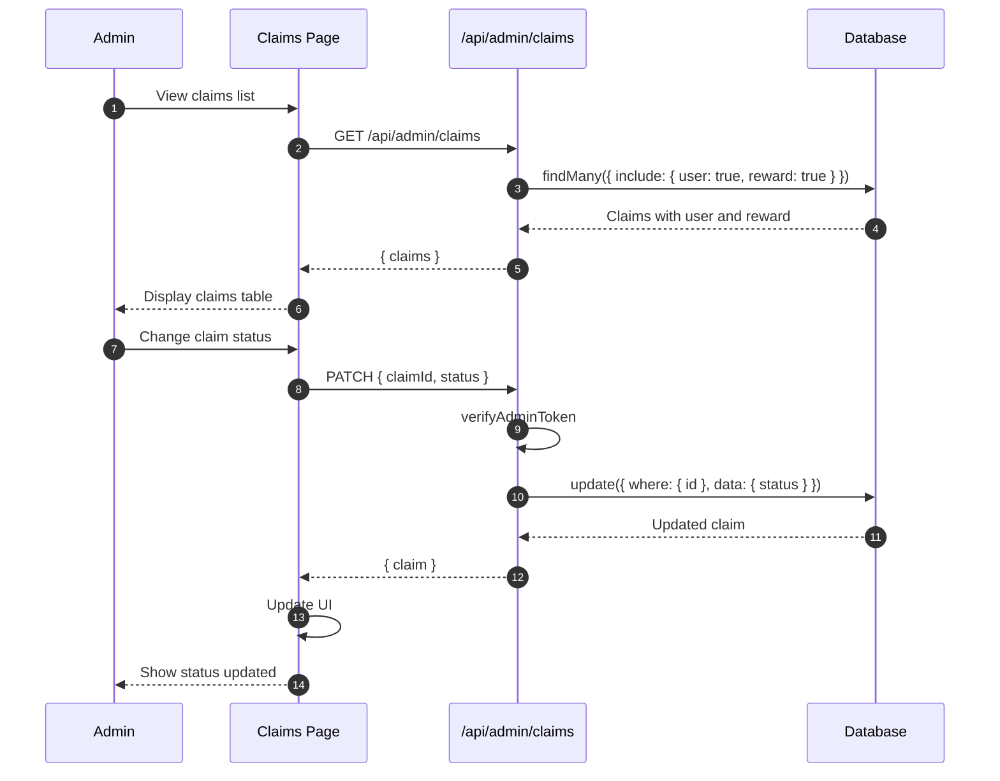
```mermaid
sequenceDiagram
    autonumber
    participant A as Admin
    participant P as Claims Page
    participant API as /api/admin/claims
    participant DB as Database

    A->>P: View claims list
    P->>API: GET /api/admin/claims
    
    API->>DB: findMany({ include: { user: true, reward: true } })
    DB-->>API: Claims with user and reward
    API-->>P: { claims }
    P-->>A: Display claims table
    
    A->>P: Change claim status
    P->>API: PATCH { claimId, status }
    
    API->>API: verifyAdminToken
    API->>DB: update({ where: { id }, data: { status } })
    DB-->>API: Updated claim
    API-->>P: { claim }
    
    P->>P: Update UI
    P-->>A: Show status updated
```

---

## 5. Error Handling Flows

### 5.1 API Error Response

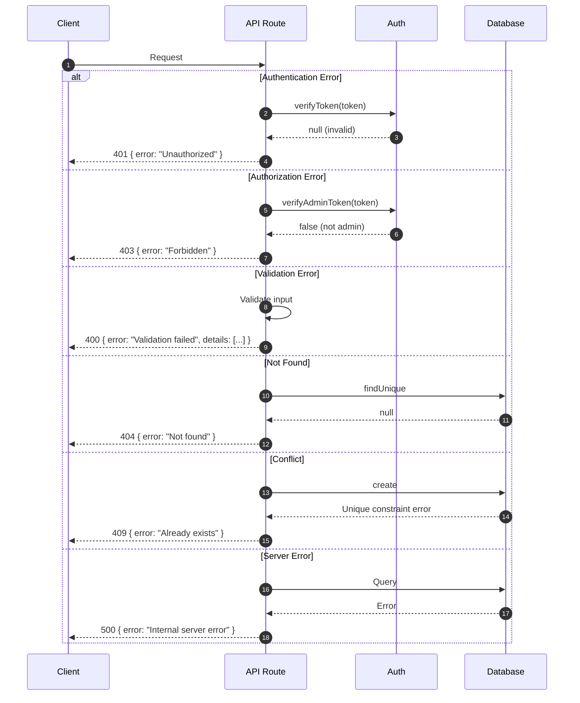
```mermaid
sequenceDiagram
    autonumber
    participant C as Client
    participant API as API Route
    participant Auth as Auth
    participant DB as Database

    C->>API: Request
    
    alt Authentication Error
        API->>Auth: verifyToken(token)
        Auth-->>API: null (invalid)
        API-->>C: 401 { error: "Unauthorized" }
    else Authorization Error
        API->>Auth: verifyAdminToken(token)
        Auth-->>API: false (not admin)
        API-->>C: 403 { error: "Forbidden" }
    else Validation Error
        API->>API: Validate input
        API-->>C: 400 { error: "Validation failed", details: [...] }
    else Not Found
        API->>DB: findUnique
        DB-->>API: null
        API-->>C: 404 { error: "Not found" }
    else Conflict
        API->>DB: create
        DB-->>API: Unique constraint error
        API-->>C: 409 { error: "Already exists" }
    else Server Error
        API->>DB: Query
        DB-->>API: Error
        API-->>C: 500 { error: "Internal server error" }
    end
```

---

*End of Sequence Diagrams Document*
