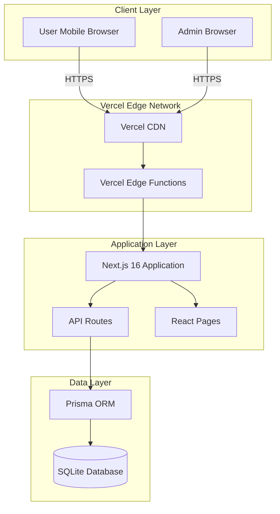
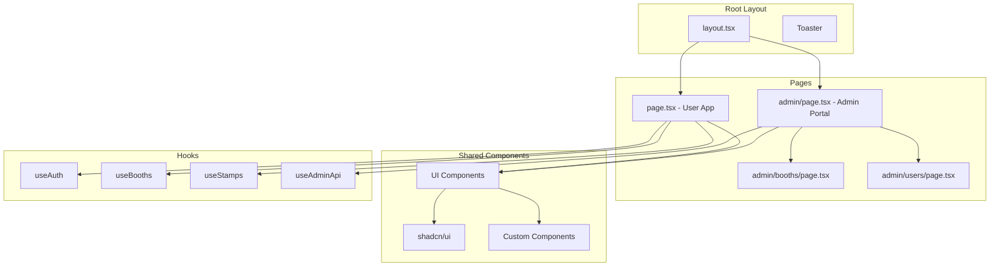
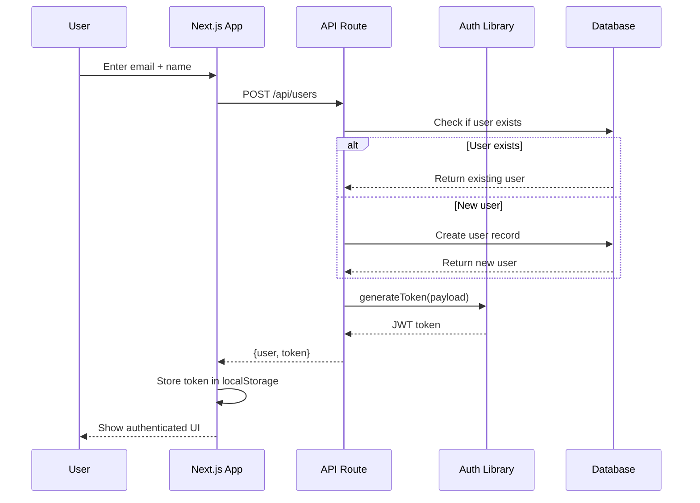
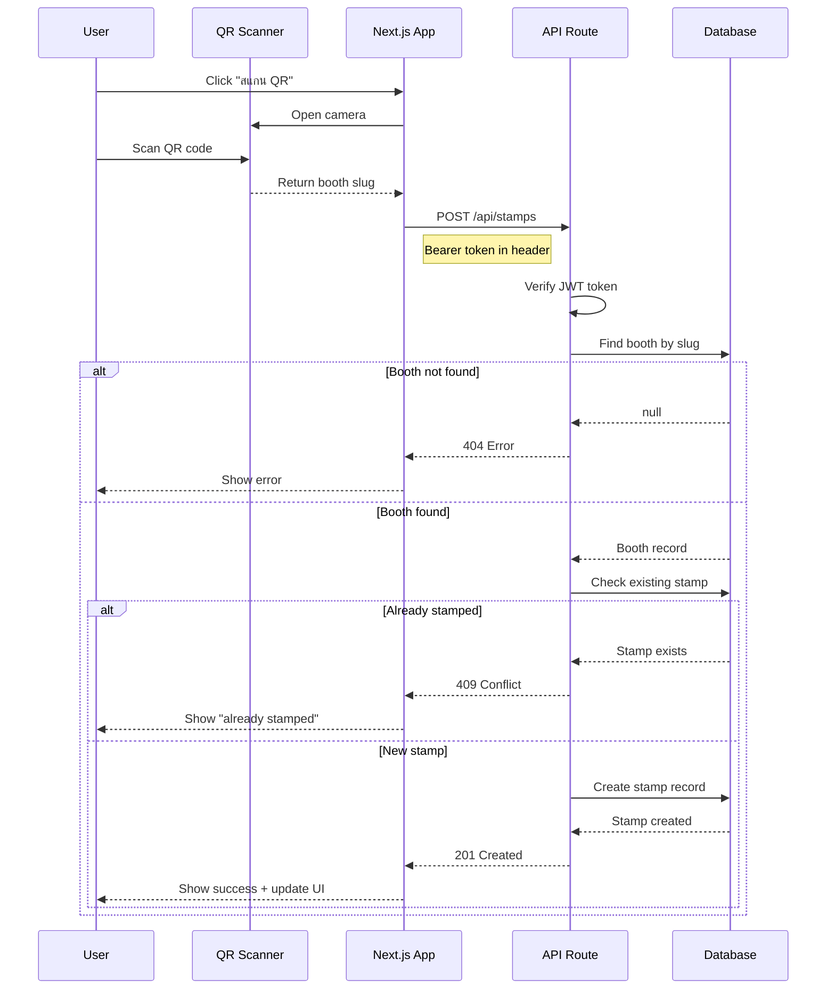
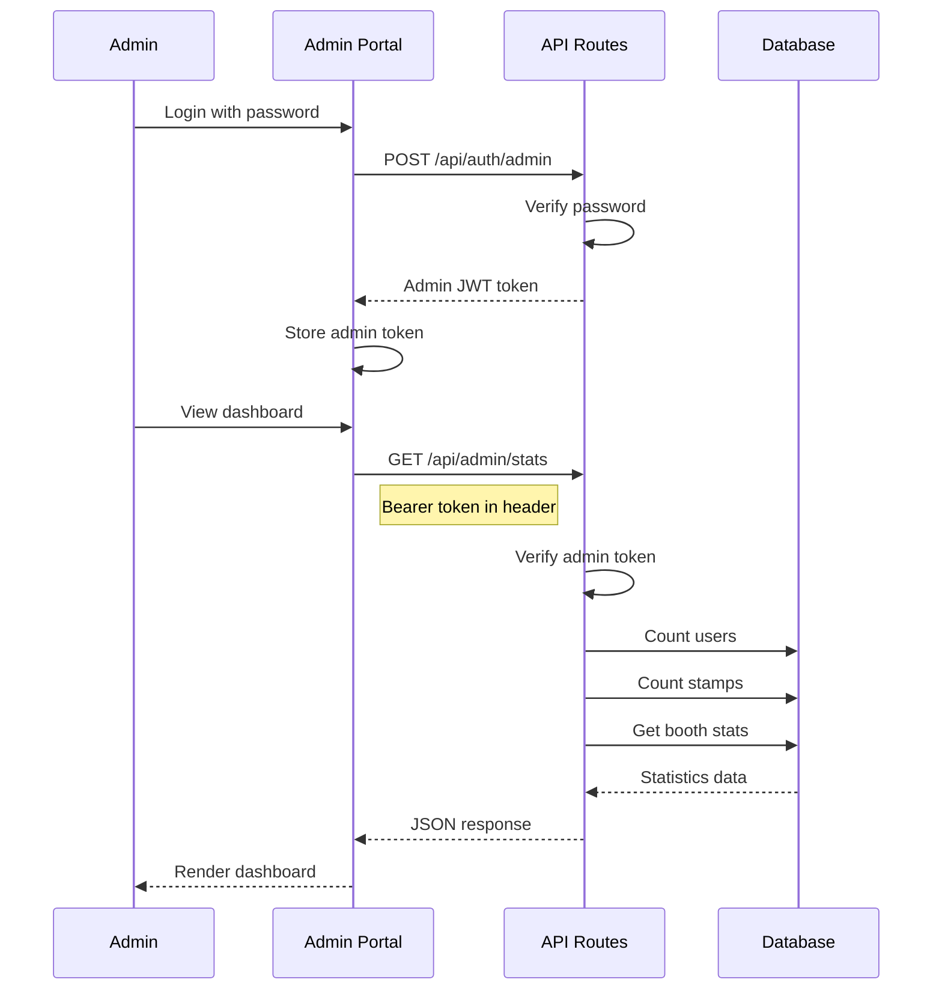
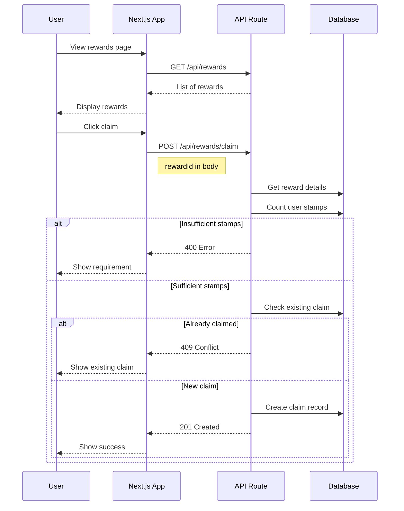
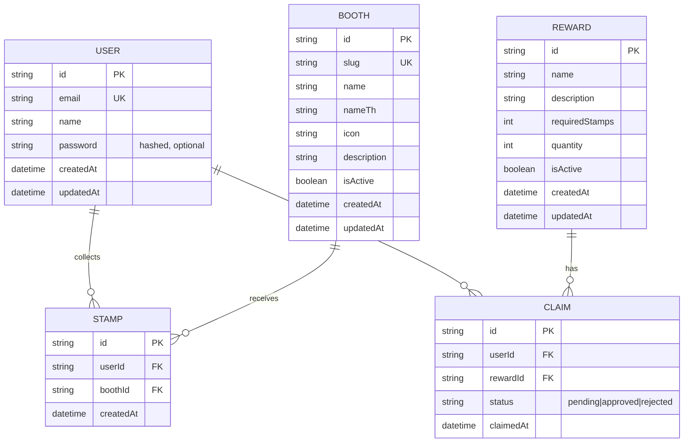
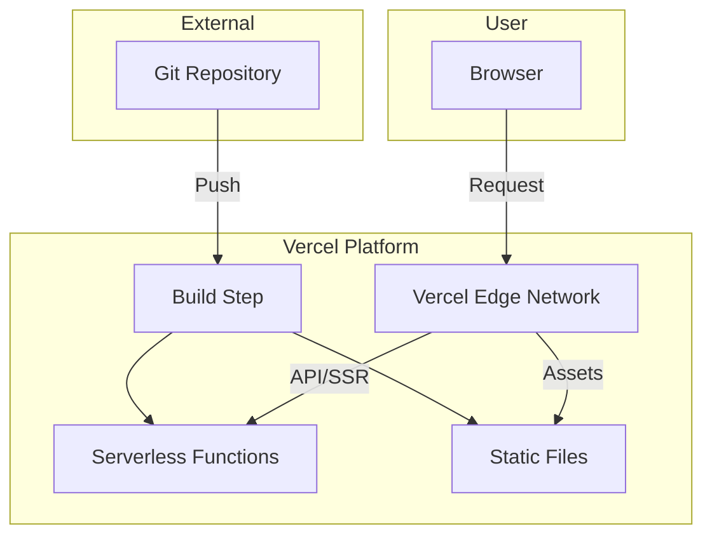

# System Architecture

## SFD Pocket - Booth Stamp Collection System

**Version:** 0.3.0 (POC Complete)  
**Date:** 2026-02-06  
**Project:** SFD Pocket - Event Gamification Platform

---

## Table of Contents

1. [Architecture Overview](#1-architecture-overview)
2. [Component Architecture](#2-component-architecture)
3. [Data Flow Diagrams](#3-data-flow-diagrams)
4. [Database Schema](#4-database-schema)
5. [API Architecture](#5-api-architecture)
6. [Deployment Architecture](#6-deployment-architecture)

---

## 1. Architecture Overview

### 1.1 High-Level Architecture



### 1.2 Architecture Patterns

| Pattern | Implementation | Purpose |
|---------|---------------|---------|
| **BFF (Backend for Frontend)** | Next.js API Routes | Unified API for client |
| **SSR (Server-Side Rendering)** | Next.js App Router | SEO and performance |
| **CSR (Client-Side Rendering)** | React Hooks | Interactive UI components |
| **Repository Pattern** | Prisma ORM | Database abstraction |
| **JWT Authentication** | jsonwebtoken library | Stateless auth |

---

## 2. Component Architecture

### 2.1 Component Hierarchy



### 2.2 Component Catalog

#### UI Components (shadcn/ui)

| Component | File | Purpose |
|-----------|------|---------|
| Button | `components/ui/button.tsx` | Actions, CTAs |
| Card | `components/ui/card.tsx` | Content containers |
| Dialog | `components/ui/dialog.tsx` | Modals, alerts |
| Input | `components/ui/input.tsx` | Form inputs |
| Avatar | `components/ui/avatar.tsx` | User profile |
| Progress | `components/ui/progress.tsx` | Progress bars |
| Badge | `components/ui/badge.tsx` | Status indicators |
| Table | `components/ui/table.tsx` | Data tables |
| Tabs | `components/ui/tabs.tsx` | Tab navigation |
| Dropdown | `components/ui/dropdown-menu.tsx` | Actions menu |

#### Custom Components

| Component | File | Purpose |
|-----------|------|---------|
| AdminLayout | `components/admin-portal/AdminLayout.tsx` | Admin page shell |
| StatCard | `components/admin-portal/dashboard.tsx` | Dashboard stats |
| BoothProgress | `components/admin-portal/dashboard.tsx` | Progress visualization |
| Loading States | `components/loading-states.tsx` | Skeleton UIs |
| Empty States | `components/empty-states.tsx` | No data views |

### 2.3 Custom Hooks

| Hook | File | Purpose |
|------|------|---------|
| useAuth | `hooks/useApi.ts` | User authentication |
| useBooths | `hooks/useApi.ts` | Fetch booths data |
| useStamps | `hooks/useApi.ts` | Stamp collection |
| useAdminAuth | `hooks/useAdminApi.ts` | Admin authentication |
| useAdminStats | `hooks/useAdminApi.ts` | Dashboard statistics |
| useAdminUsers | `hooks/useAdminApi.ts` | User management |
| useAdminBooths | `hooks/useAdminApi.ts` | Booth management |

---

## 3. Data Flow Diagrams

### 3.1 Authentication Flow



### 3.2 Stamp Collection Flow



### 3.3 Admin Dashboard Flow



### 3.4 Reward Claim Flow



---

## 4. Database Schema

### 4.1 Entity Relationship Diagram



### 4.2 Table Definitions

#### User Table

| Field | Type | Constraints | Description |
|-------|------|-------------|-------------|
| id | String | PK, UUID | Unique identifier |
| email | String | Unique, Required | User email address |
| name | String | Optional | Display name |
| password | String | Optional, Hashed | For future email/password auth |
| createdAt | DateTime | Auto | Registration timestamp |
| updatedAt | DateTime | Auto | Last update timestamp |

#### Booth Table

| Field | Type | Constraints | Description |
|-------|------|-------------|-------------|
| id | String | PK, UUID | Unique identifier |
| slug | String | Unique, Required | URL-friendly identifier |
| name | String | Required | Display name (English) |
| nameTh | String | Optional | Display name (Thai) |
| icon | String | Optional | Emoji/icon representation |
| description | String | Optional | Booth description |
| isActive | Boolean | Default: true | Active status |
| createdAt | DateTime | Auto | Creation timestamp |
| updatedAt | DateTime | Auto | Last update timestamp |

#### Stamp Table

| Field | Type | Constraints | Description |
|-------|------|-------------|-------------|
| id | String | PK, UUID | Unique identifier |
| userId | String | FK, Required | Reference to User |
| boothId | String | FK, Required | Reference to Booth |
| createdAt | DateTime | Auto | Collection timestamp |

**Unique Constraint:** (userId, boothId) - Prevents duplicate stamps

#### Reward Table

| Field | Type | Constraints | Description |
|-------|------|-------------|-------------|
| id | String | PK, UUID | Unique identifier |
| name | String | Required | Reward name |
| description | String | Optional | Reward description |
| requiredStamps | Int | Default: 7 | Stamps needed to claim |
| quantity | Int | Default: 0 | Available quantity |
| isActive | Boolean | Default: true | Active status |
| createdAt | DateTime | Auto | Creation timestamp |
| updatedAt | DateTime | Auto | Last update timestamp |

#### Claim Table

| Field | Type | Constraints | Description |
|-------|------|-------------|-------------|
| id | String | PK, UUID | Unique identifier |
| userId | String | FK, Required | Reference to User |
| rewardId | String | FK, Required | Reference to Reward |
| status | String | Default: "pending" | Claim status |
| claimedAt | DateTime | Auto | Claim timestamp |

### 4.3 Relationships

| Relationship | Type | Description |
|--------------|------|-------------|
| User → Stamps | One-to-Many | A user can have many stamps |
| User → Claims | One-to-Many | A user can make many claims |
| Booth → Stamps | One-to-Many | A booth can have many stamps |
| Reward → Claims | One-to-Many | A reward can have many claims |
| User ↔ Booth | Many-to-Many | Via Stamp junction table |

---

## 5. API Architecture

### 5.1 RESTful Endpoints

#### User Endpoints

| Method | Endpoint | Auth | Description |
|--------|----------|------|-------------|
| POST | `/api/users` | No | Register/login user |
| GET | `/api/auth/me` | Yes | Get current user |

#### Booth Endpoints

| Method | Endpoint | Auth | Description |
|--------|----------|------|-------------|
| GET | `/api/booths` | Yes | List active booths |

#### Stamp Endpoints

| Method | Endpoint | Auth | Description |
|--------|----------|------|-------------|
| POST | `/api/stamps` | Yes | Collect stamp |
| GET | `/api/users/:id/stamps` | Yes | Get user stamps |

#### Reward Endpoints

| Method | Endpoint | Auth | Description |
|--------|----------|------|-------------|
| POST | `/api/rewards/claim` | Yes | Claim reward |

#### Admin Endpoints

| Method | Endpoint | Auth | Description |
|--------|----------|------|-------------|
| POST | `/api/auth/admin` | No | Admin login |
| GET | `/api/admin/stats` | Admin | Dashboard stats |
| GET | `/api/admin/booths` | Admin | List all booths |
| POST | `/api/admin/booths` | Admin | Create booth |
| DELETE | `/api/admin/booths/:id` | Admin | Delete booth |
| GET | `/api/admin/users` | Admin | List users |
| GET | `/api/admin/claims` | Admin | List claims |
| PATCH | `/api/admin/claims` | Admin | Update claim status |

### 5.2 Authentication Middleware

```typescript
// User Authentication
function verifyToken(token: string): JWTPayload | null {
  try {
    return jwt.verify(token, JWT_SECRET) as JWTPayload;
  } catch {
    return null;
  }
}

// Admin Authentication
function verifyAdminToken(token: string): boolean {
  try {
    const decoded = jwt.verify(token, JWT_SECRET) as { isAdmin?: boolean };
    return decoded.isAdmin === true;
  } catch {
    return false;
  }
}
```

### 5.3 Request/Response Examples

#### Register User

**Request:**
```http
POST /api/users
Content-Type: application/json

{
  "email": "user@example.com",
  "name": "John Doe"
}
```

**Response:**
```json
{
  "user": {
    "id": "uuid",
    "email": "user@example.com",
    "name": "John Doe"
  },
  "token": "jwt-token-string"
}
```

#### Collect Stamp

**Request:**
```http
POST /api/stamps
Authorization: Bearer <token>
Content-Type: application/json

{
  "boothId": "booth-uuid",
  "boothSlug": "booth-slug"
}
```

**Response (Success):**
```json
{
  "message": "Stamp collected successfully",
  "stamp": {
    "id": "stamp-uuid",
    "userId": "user-uuid",
    "boothId": "booth-uuid",
    "createdAt": "2026-02-06T00:00:00Z",
    "booth": {
      "id": "booth-uuid",
      "slug": "booth-slug",
      "name": "Booth Name",
      "nameTh": "ชื่อบูธ",
      "icon": "📍"
    }
  }
}
```

**Response (Already Stamped):**
```json
{
  "error": "Stamp already collected",
  "stamp": { ... }
}
```

#### Admin Dashboard Stats

**Request:**
```http
GET /api/admin/stats
Authorization: Bearer <admin-token>
```

**Response:**
```json
{
  "stats": {
    "totalUsers": 150,
    "totalStamps": 420,
    "completionRate": 35,
    "activeNow": 25,
    "boothStats": [
      {
        "id": "booth-uuid",
        "name": "Registration Booth",
        "stamps": 145,
        "target": 500
      }
    ]
  }
}
```

---

## 6. Deployment Architecture

### 6.1 Vercel Hosting



### 6.2 Environment Variables

| Variable | Type | Description |
|----------|------|-------------|
| `DATABASE_URL` | Required | SQLite database path |
| `JWT_SECRET` | Required | JWT signing secret |
| `ADMIN_PASSWORD` | Required | Admin portal password |
| `NEXT_PUBLIC_APP_NAME` | Public | App display name |
| `NEXT_PUBLIC_APP_VERSION` | Public | App version |

### 6.3 Database Setup

```bash
# Generate Prisma client
npm run db:generate

# Run migrations
npm run db:migrate

# Seed database
npm run db:seed

# Open Prisma Studio
npm run db:studio
```

### 6.4 Deployment Process

1. **Build Phase:**
   - TypeScript compilation
   - Prisma client generation
   - Next.js build with Turbopack

2. **Deploy Phase:**
   - Static assets to CDN
   - API routes to serverless functions
   - Database migrations (manual)

3. **Post-Deploy:**
   - Health check
   - Smoke tests
   - CDN cache invalidation

---

*End of System Architecture Document*
