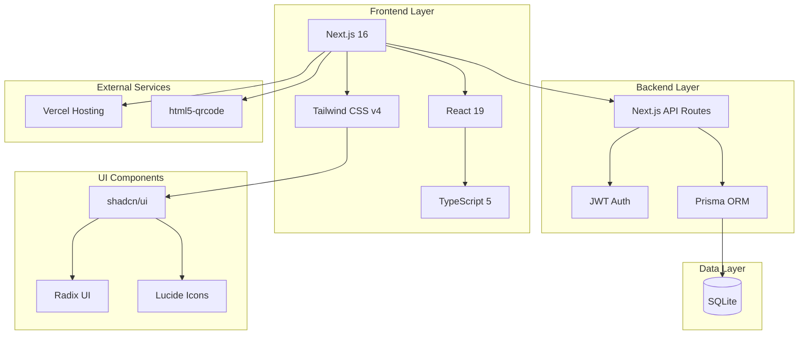

# Tech Stack

## SFD Pocket - Technology Stack Documentation

**Version:** 0.3.0  
**Last Updated:** 2026-02-06

---

## Table of Contents

1. [Overview](#1-overview)
2. [Frontend](#2-frontend)
3. [Backend](#3-backend)
4. [Database](#4-database)
5. [Testing](#5-testing)
6. [DevOps](#6-devops)
7. [Dependencies](#7-dependencies)

---

## 1. Overview

### 1.1 Architecture Stack



### 1.2 Technology Selection Rationale

| Technology | Reason |
|------------|--------|
| Next.js 16 | Full-stack React framework with App Router |
| React 19 | Latest React features and improvements |
| TypeScript 5 | Type safety and better developer experience |
| Tailwind CSS v4 | Utility-first CSS with v4 performance |
| Prisma ORM | Type-safe database access |
| SQLite | Simple, file-based database for POC |
| JWT | Stateless authentication |

---

## 2. Frontend

### 2.1 Core Framework

| Technology | Version | Purpose |
|------------|---------|---------|
| Next.js | 16.1.6 | React framework with SSR/SSG |
| React | 19.2.3 | UI library |
| React DOM | 19.2.3 | DOM renderer |
| TypeScript | ^5 | Type safety |

**Key Features:**
- App Router for file-based routing
- Server Components by default
- Client Components for interactivity
- API Routes for backend

### 2.2 Styling

| Technology | Version | Purpose |
|------------|---------|---------|
| Tailwind CSS | v4 | Utility-first CSS |
| tailwind-merge | ^3.4.0 | Merge Tailwind classes |
| clsx | ^2.1.1 | Conditional class names |
| tw-animate-css | ^1.4.0 | Animation utilities |
| next-themes | ^0.4.6 | Theme management |

**Tailwind Configuration:**
- Custom color scheme (amber primary)
- Custom animations for celebrations
- Responsive breakpoints

### 2.3 UI Components

| Technology | Version | Purpose |
|------------|---------|---------|
| shadcn/ui | latest | Base component library |
| Radix UI | ^1.4.3 | Headless UI primitives |
| Lucide React | ^0.563.0 | Icon library |
| class-variance-authority | ^0.7.1 | Component variants |

**shadcn/ui Components Used:**
- Button
- Card
- Dialog
- Input
- Avatar
- Progress
- Badge
- Table
- Tabs
- Dropdown Menu

### 2.4 QR Scanning

| Technology | Version | Purpose |
|------------|---------|---------|
| html5-qrcode | ^2.3.8 | QR code scanning |

**Features:**
- Camera-based QR scanning
- Multi-camera support
- Permission handling

### 2.5 State Management

| Approach | Purpose |
|----------|---------|
| React Hooks | Local component state |
| Custom Hooks | API data fetching |
| localStorage | Token persistence |
| SWR Pattern | Server state caching |

### 2.6 Custom Hooks

| Hook | File | Purpose |
|------|------|---------|
| useAuth | `hooks/useApi.ts` | User authentication |
| useBooths | `hooks/useApi.ts` | Fetch booths |
| useStamps | `hooks/useApi.ts` | Stamp management |
| useAdminAuth | `hooks/useAdminApi.ts` | Admin auth |
| useAdminStats | `hooks/useAdminApi.ts` | Dashboard stats |
| useAdminUsers | `hooks/useAdminApi.ts` | User management |
| useAdminBooths | `hooks/useAdminApi.ts` | Booth management |

---

## 3. Backend

### 3.1 API Layer

| Technology | Purpose |
|------------|---------|
| Next.js API Routes | RESTful endpoints |
| Route Handlers | Request processing |
| Middleware | Auth verification |

### 3.2 Authentication

| Technology | Version | Purpose |
|------------|---------|---------|
| jsonwebtoken | ^9.0.2 | JWT signing/verification |
| bcryptjs | ^2.4.3 | Password hashing |

**JWT Configuration:**
- User tokens: 7 day expiry
- Admin tokens: 24 hour expiry
- HS256 algorithm

### 3.3 Database Access

| Technology | Version | Purpose |
|------------|---------|---------|
| Prisma Client | ^6.3.0 | Type-safe database ORM |
| @prisma/client | ^6.3.0 | Generated client |

**Prisma Features:**
- Schema-first development
- Type-safe queries
- Migration system
- Relation handling

---

## 4. Database

### 4.1 Database Engine

| Technology | Version | Purpose |
|------------|---------|---------|
| SQLite | 3 | File-based database |
| Prisma | ^6.3.0 | ORM and migrations |

**Schema:**
- User
- Booth
- Stamp
- Reward
- Claim

### 4.2 Migration Strategy

```bash
# Development
npm run db:migrate    # Create and apply migrations
npm run db:push       # Prototype schema changes

# Production
npm run db:deploy     # Apply pending migrations
```

---

## 5. Testing

### 5.1 Unit Testing

| Technology | Version | Purpose |
|------------|---------|---------|
| Jest | ^30.2.0 | Test runner |
| React Testing Library | ^16.3.2 | Component testing |
| jest-environment-jsdom | ^30.2.0 | DOM environment |
| @testing-library/jest-dom | ^6.9.1 | DOM matchers |
| @testing-library/user-event | ^14.6.1 | User interactions |

**Test Commands:**
```bash
npm test              # Run tests
npm run test:watch    # Watch mode
npm run test:coverage # Coverage report
```

### 5.2 E2E Testing

| Technology | Version | Purpose |
|------------|---------|---------|
| Playwright | ^1.58.1 | E2E testing |

**Test Commands:**
```bash
npm run test:e2e      # Run E2E tests
npm run test:e2e:ui   # UI mode
npm run test:e2e:debug # Debug mode
```

### 5.3 Test Coverage Goals

| Type | Target |
|------|--------|
| Unit Tests | 80%+ |
| Component Tests | 70%+ |
| E2E Tests | Critical paths |

---

## 6. DevOps

### 6.1 Build Tools

| Technology | Version | Purpose |
|------------|---------|---------|
| Turbopack | bundled | Fast bundler |
| TypeScript | ^5 | Compilation |
| PostCSS | - | CSS processing |

### 6.2 Code Quality

| Technology | Version | Purpose |
|------------|---------|---------|
| ESLint | ^9 | Linting |
| eslint-config-next | 16.1.6 | Next.js rules |
| eslint-plugin-unused-imports | ^4.3.0 | Clean imports |
| Prettier | ^3.8.1 | Code formatting |
| prettier-plugin-tailwindcss | ^0.7.2 | Tailwind formatting |
| markdownlint-cli2 | ^0.20.0 | Markdown linting |

### 6.3 Git Hooks

| Hook | Tools |
|------|-------|
| pre-commit | Prettier, ESLint, markdownlint |
| pre-push | Full test suite |

### 6.4 CI/CD

| Platform | Features |
|----------|----------|
| GitHub Actions | Automated testing |
| Vercel | Auto-deployment |

**CI Pipeline:**
1. Lint check
2. Type check
3. Unit tests
4. Security scan (Semgrep)
5. Vulnerability scan (Trivy)
6. Build
7. Deploy

### 6.5 Security Tools

| Tool | Purpose |
|------|---------|
| Semgrep | SAST scanning |
| Trivy | Vulnerability + secret scanning |

**Commands:**
```bash
npm run scan:semgrep  # Run Semgrep
npm run scan:trivy    # Run Trivy
npm run scan          # Run both
npm run qa            # Full QA pipeline
```

---

## 7. Dependencies

### 7.1 Production Dependencies

```json
{
  "@prisma/client": "^6.3.0",
  "bcryptjs": "^2.4.3",
  "class-variance-authority": "^0.7.1",
  "clsx": "^2.1.1",
  "html5-qrcode": "^2.3.8",
  "jsonwebtoken": "^9.0.2",
  "lucide-react": "^0.563.0",
  "next": "16.1.6",
  "next-themes": "^0.4.6",
  "radix-ui": "^1.4.3",
  "react": "19.2.3",
  "react-dom": "19.2.3",
  "sonner": "^2.0.7",
  "tailwind-merge": "^3.4.0",
  "tw-animate-css": "^1.4.0"
}
```

### 7.2 Development Dependencies

```json
{
  "@playwright/test": "^1.58.1",
  "@tailwindcss/postcss": "^4",
  "@testing-library/jest-dom": "^6.9.1",
  "@testing-library/react": "^16.3.2",
  "@testing-library/user-event": "^14.6.1",
  "@types/bcryptjs": "^2.4.6",
  "@types/jest": "^30.0.0",
  "@types/jsonwebtoken": "^9.0.8",
  "@types/node": "^20",
  "@types/react": "^19",
  "@types/react-dom": "^19",
  "eslint": "^9",
  "eslint-config-next": "16.1.6",
  "eslint-plugin-unused-imports": "^4.3.0",
  "jest": "^30.2.0",
  "jest-environment-jsdom": "^30.2.0",
  "markdownlint-cli2": "^0.20.0",
  "prettier": "^3.8.1",
  "prettier-plugin-tailwindcss": "^0.7.2",
  "prisma": "^6.3.0",
  "qrcode": "^1.5.4",
  "tailwindcss": "^4",
  "ts-node": "^10.9.2",
  "tsx": "^4.19.0",
  "typescript": "^5"
}
```

### 7.3 Node.js Requirements

| Requirement | Version |
|-------------|---------|
| Node.js | >= 20.0.0 |
| npm | >= 9.0.0 |
| pnpm | >= 9.0.0 (recommended) |

---

## 8. Project Scripts

### 8.1 Development

| Script | Command | Purpose |
|--------|---------|---------|
| dev | `next dev` | Start dev server |
| build | `next build` | Production build |
| start | `next start` | Start production server |

### 8.2 Testing

| Script | Command | Purpose |
|--------|---------|---------|
| test | `jest` | Run unit tests |
| test:watch | `jest --watch` | Watch mode |
| test:coverage | `jest --coverage` | Coverage report |
| test:e2e | `playwright test` | E2E tests |

### 8.3 Quality

| Script | Command | Purpose |
|--------|---------|---------|
| lint | `eslint .` | Run linter |
| lint:fix | `eslint . --fix` | Fix lint errors |
| scan:semgrep | `semgrep scan` | Security scan |
| scan:trivy | `trivy fs` | Vulnerability scan |
| qa | `lint + test + scan` | Full QA |

### 8.4 Database

| Script | Command | Purpose |
|--------|---------|---------|
| db:generate | `prisma generate` | Generate client |
| db:migrate | `prisma migrate dev` | Create migration |
| db:push | `prisma db push` | Push schema |
| db:seed | `tsx prisma/seed.ts` | Seed data |
| db:studio | `prisma studio` | DB GUI |
| db:reset | `prisma migrate reset` | Reset DB |

---

## 9. Future Considerations

### 9.1 Scalability Path

| Current | Future | Migration |
|---------|--------|-----------|
| SQLite | PostgreSQL | Prisma migration |
| Vercel | GCP Cloud Run | Containerization |
| JWT sessions | Redis sessions | Session store |
| File uploads | Cloud Storage | S3/Cloudinary |

### 9.2 Planned Technologies

| Feature | Technology |
|---------|------------|
| Analytics | Recharts |
| Real-time | WebSockets / SSE |
| Push Notifications | Web Push API |
| PWA | next-pwa |
| Image Optimization | next/image |

---

*End of Tech Stack Document*
