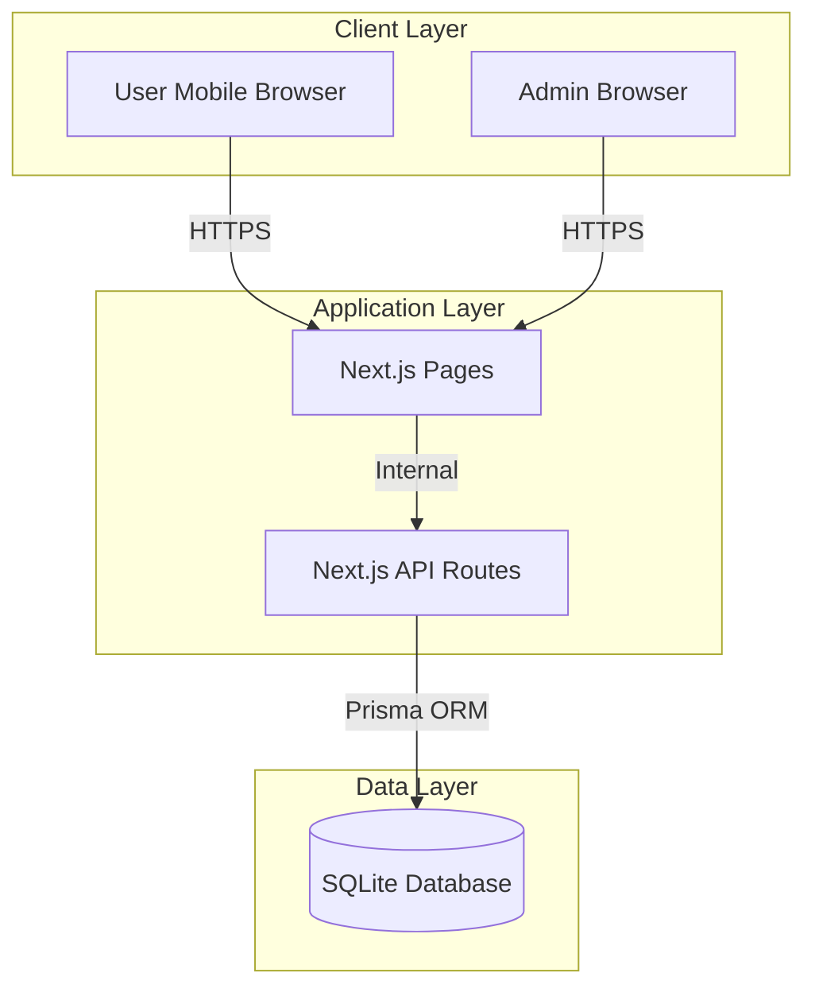

# Software Requirements Specification (SRS)

## SFD Pocket - Booth Stamp Collection System

**Version:** 0.3.0 (POC Complete)  
**Date:** 2026-02-06  
**Project:** SFD Pocket - Event Gamification Platform  
**Status:** 90% Complete (Prototype Phase)

---

## Table of Contents

1. [Introduction](#1-introduction)
2. [Overall Description](#2-overall-description)
3. [Specific Requirements](#3-specific-requirements)
4. [Use Cases](#4-use-cases)
5. [Traceability Matrix](#5-traceability-matrix)

---

## 1. Introduction

### 1.1 Purpose

This Software Requirements Specification (SRS) document defines the functional and non-functional requirements for the **SFD Pocket** system — a mobile-first Progressive Web App (PWA) for event booth stamp collection and gamification. This document serves as the primary reference for design, development, testing, and acceptance.

### 1.2 Scope

The SFD Pocket system provides:

- **User-facing features:**
  - User registration and authentication
  - QR code-based stamp collection at event booths
  - Real-time progress tracking
  - Reward claiming system

- **Admin-facing features:**
  - Secure admin authentication (JWT)
  - Dashboard with statistics
  - Booth management (CRUD operations)
  - User management and export
  - Reward claim verification

**Out of scope:**
- Advanced analytics with charts (SFD-006 - Planned)
- Mobile-responsive admin portal optimization (SFD-007 - Planned)
- Native mobile apps (iOS/Android)

### 1.3 Definitions, Acronyms, and Abbreviations

| Term | Definition |
|------|------------|
| SFD | Skooldio Festival Day / Event |
| PWA | Progressive Web App |
| JWT | JSON Web Token |
| QR | Quick Response (code) |
| CRUD | Create, Read, Update, Delete |
| POC | Proof of Concept |
| API | Application Programming Interface |
| ORM | Object-Relational Mapping |
| SSR | Server-Side Rendering |
| BFF | Backend for Frontend |

### 1.4 References

| # | Document | Location |
|---|----------|----------|
| REF-1 | Jira Project | SFD-001 to SFD-007 |
| REF-2 | System Architecture | `docs/architecture/SYSTEM_ARCHITECTURE.md` |
| REF-3 | API Specification | `docs/specs/API_SPECIFICATION.md` |
| REF-4 | Database Model | `docs/architecture/DATA_MODEL.md` |

---

## 2. Overall Description

### 2.1 Product Perspective

### 2.2 Product Functions

| # | Function | Description |
|---|----------|-------------|
| F1 | User Authentication | JWT-based registration and login |
| F2 | QR Stamp Collection | Scan booth QR codes to collect stamps |
| F3 | Progress Tracking | Real-time progress visualization |
| F4 | Reward Claiming | Claim rewards after completing requirements |
| F5 | Admin Dashboard | Statistics and overview |
| F6 | Booth Management | Create, edit, delete booths |
| F7 | User Management | View users, export data |
| F8 | Claim Management | Approve/reject reward claims |

### 2.3 User Characteristics

| User Type | Description | Technical Proficiency |
|-----------|-------------|----------------------|
| **Event Attendee** | Event participants using mobile phones | Low-Medium |
| **Event Admin** | Staff managing the event | Medium |
| **System Admin** | Technical administrators | High |

### 2.4 Constraints

| # | Constraint |
|---|------------|
| C1 | Must work on mobile browsers (iOS Safari, Chrome Android) |
| C2 | Camera API requires HTTPS in production |
| C3 | SQLite database (upgradeable to PostgreSQL) |
| C4 | Thai/English bilingual support |

### 2.5 Assumptions and Dependencies

| # | Type | Description |
|---|------|-------------|
| A1 | Assumption | Users have smartphones with cameras |
| A2 | Assumption | Each booth has a unique QR code |
| D1 | Dependency | Vercel for hosting |
| D2 | Dependency | Prisma ORM for database access |

---

## 3. Specific Requirements

### 3.1 Functional Requirements

#### 3.1.1 User Authentication (SFD-001)

| ID | Requirement | Priority |
|----|-------------|----------|
| FR-1.1 | Users can register with email and optional name | High |
| FR-1.2 | System generates JWT token upon registration | High |
| FR-1.3 | Token persists in localStorage for session management | High |
| FR-1.4 | Token expires after 7 days | Medium |
| FR-1.5 | Users can logout (clears token) | Medium |

#### 3.1.2 QR Stamp Collection (SFD-002, SFD-003)

| ID | Requirement | Priority |
|----|-------------|----------|
| FR-2.1 | Users can open QR scanner from main page | High |
| FR-2.2 | Scanner uses device camera with environment facing mode | High |
| FR-2.3 | Scanner supports camera switching on multi-camera devices | Medium |
| FR-2.4 | QR codes encode booth slug for identification | High |
| FR-2.5 | System validates booth existence before stamp creation | High |
| FR-2.6 | Duplicate stamps are prevented (idempotent) | High |
| FR-2.7 | Success/error feedback shown after scan | High |
| FR-2.8 | Camera permission errors are handled gracefully | High |

#### 3.1.3 Progress Tracking (SFD-002)

| ID | Requirement | Priority |
|----|-------------|----------|
| FR-3.1 | Progress bar shows percentage of completed booths | High |
| FR-3.2 | Counter shows "X/Y" completed format | High |
| FR-3.3 | Booth grid shows stamped/unstamped status visually | High |
| FR-3.4 | Completion celebration triggers at 100% | Medium |
| FR-3.5 | Progress data fetched from server (not just local) | High |

#### 3.1.4 Reward Claiming (SFD-005)

| ID | Requirement | Priority |
|----|-------------|----------|
| FR-4.1 | Users can view available rewards | High |
| FR-4.2 | Reward eligibility based on stamp count requirement | High |
| FR-4.3 | Users can claim rewards they are eligible for | High |
| FR-4.4 | Duplicate claims are prevented | High |
| FR-4.5 | Claim status is tracked (pending/approved/rejected) | Medium |

#### 3.1.5 Admin Authentication (SFD-001)

| ID | Requirement | Priority |
|----|-------------|----------|
| FR-5.1 | Admin login requires password | High |
| FR-5.2 | Admin JWT token expires after 24 hours | High |
| FR-5.3 | Admin token stored separately from user token | High |
| FR-5.4 | Unauthorized access redirects to login | High |

#### 3.1.6 Admin Dashboard (SFD-002)

| ID | Requirement | Priority |
|----|-------------|----------|
| FR-6.1 | Dashboard shows total users count | High |
| FR-6.2 | Dashboard shows total stamps collected | High |
| FR-6.3 | Dashboard shows completion rate percentage | High |
| FR-6.4 | Dashboard shows active users (mocked in POC) | Medium |
| FR-6.5 | Auto-refresh functionality available | Medium |
| FR-6.6 | Manual refresh button available | Medium |

#### 3.1.7 Booth Management (SFD-003)

| ID | Requirement | Priority |
|----|-------------|----------|
| FR-7.1 | Admin can create new booths | High |
| FR-7.2 | Booth creation requires slug and name | High |
| FR-7.3 | Slug must be unique and URL-safe | High |
| FR-7.4 | Admin can edit booth details | High |
| FR-7.5 | Admin can delete booths with confirmation | High |
| FR-7.6 | Admin can toggle booth active status | Medium |
| FR-7.7 | Admin can view booth QR codes | High |
| FR-7.8 | Form validation for all fields | High |

#### 3.1.8 User Management (SFD-004)

| ID | Requirement | Priority |
|----|-------------|----------|
| FR-8.1 | Admin can list all users | High |
| FR-8.2 | User list shows stamp count per user | High |
| FR-8.3 | User list shows completion progress percentage | High |
| FR-8.4 | User list shows last active timestamp | Medium |
| FR-8.5 | Search functionality for users | Medium |
| FR-8.6 | Export user data to CSV | High |

#### 3.1.9 Claim Management (SFD-005)

| ID | Requirement | Priority |
|----|-------------|----------|
| FR-9.1 | Admin can view all reward claims | High |
| FR-9.2 | Claims show user and reward information | High |
| FR-9.3 | Admin can update claim status | High |
| FR-9.4 | Status options: pending, approved, rejected | High |
| FR-9.5 | Filter claims by status | Medium |

### 3.2 Non-Functional Requirements

#### 3.2.1 Performance Requirements

| ID | Requirement |
|----|-------------|
| NFR-P1 | Pages load within 2 seconds on 4G mobile connection |
| NFR-P2 | QR scanner initializes within 3 seconds |
| NFR-P3 | API responses complete within 1 second |
| NFR-P4 | Database queries complete within 500ms |

#### 3.2.2 Security Requirements

| ID | Requirement |
|----|-------------|
| NFR-S1 | All communication uses HTTPS |
| NFR-S2 | JWT tokens are cryptographically signed |
| NFR-S3 | Passwords are hashed with bcrypt (10 rounds) |
| NFR-S4 | API endpoints validate authentication |
| NFR-S5 | Admin endpoints require admin token |
| NFR-S6 | SQL injection prevention via Prisma ORM |

#### 3.2.3 Scalability Requirements

| ID | Requirement |
|----|-------------|
| NFR-SC1 | SQLite → PostgreSQL migration path documented |
| NFR-SC2 | Database schema supports horizontal scaling |
| NFR-SC3 | Static assets served via CDN |

#### 3.2.4 Compatibility Requirements

| ID | Requirement |
|----|-------------|
| NFR-C1 | Works on iOS Safari 14+ |
| NFR-C2 | Works on Chrome Android 90+ |
| NFR-C3 | Works on Samsung Internet 15+ |
| NFR-C4 | Responsive design (320px - 1920px width) |

#### 3.2.5 Quality Attributes

| ID | Attribute | Requirement |
|----|-----------|-------------|
| NFR-Q1 | Usability | Mobile-first responsive design |
| NFR-Q2 | Usability | Thai language UI |
| NFR-Q3 | Reliability | 99% uptime during event hours |
| NFR-Q4 | Maintainability | ESLint + TypeScript strict mode |
| NFR-Q5 | Testability | Unit test coverage ≥ 80% |

### 3.3 Design Constraints

| ID | Constraint |
|----|------------|
| DC-1 | Frontend: Next.js 16, TypeScript 5, React 19, Tailwind CSS v4 |
| DC-2 | QR scanning: html5-qrcode library |
| DC-3 | Testing: Jest 30 + React Testing Library 16 |
| DC-4 | Database: Prisma ORM with SQLite |
| DC-5 | Build tool: Turbopack |

---

## 4. Use Cases

### UC-001: User Collects Stamp

**Actor:** Event Attendee  
**Precondition:** User is authenticated  
**Postcondition:** Stamp is recorded for user

**Main Flow:**
1. User opens app and views booth grid
2. User taps "สแกน QR" button
3. System requests camera permission
4. User grants permission
5. System opens QR scanner
6. User scans booth QR code
7. System validates booth and creates stamp
8. System updates booth grid with success status
9. User views updated progress

**Alternative Flows:**
- 3a. Permission denied: Show error with retry option
- 7a. Duplicate stamp: Show "already stamped" message
- 7b. Invalid booth: Show error message

### UC-002: Admin Creates Booth

**Actor:** Event Admin  
**Precondition:** Admin is authenticated  
**Postcondition:** New booth is created in system

**Main Flow:**
1. Admin logs into admin portal
2. Admin navigates to booth management
3. Admin clicks "Add Booth"
4. System displays creation form
5. Admin enters booth details (slug, name, etc.)
6. System validates input
7. System creates booth
8. System displays success message

**Alternative Flows:**
- 6a. Validation fails: Show error messages
- 6b. Duplicate slug: Show uniqueness error

### UC-003: User Claims Reward

**Actor:** Event Attendee  
**Precondition:** User has required stamps  
**Postcondition:** Reward claim is recorded

**Main Flow:**
1. User views reward page
2. System shows eligible rewards
3. User selects reward to claim
4. System validates stamp count
5. System creates claim record
6. System shows success message

**Alternative Flows:**
- 4a. Insufficient stamps: Show requirement message
- 5a. Already claimed: Show existing claim status

### UC-004: Admin Views Statistics

**Actor:** Event Admin  
**Precondition:** Admin is authenticated  
**Postcondition:** Statistics are displayed

**Main Flow:**
1. Admin logs into admin portal
2. System displays dashboard
3. System fetches statistics from database
4. System displays:
   - Total users
   - Total stamps
   - Completion rate
   - Booth statistics

---

## 5. Traceability Matrix

| Requirement ID | Jira Story | Feature | Priority | Status |
|----------------|------------|---------|----------|--------|
| FR-1.1 | SFD-001 | User Registration | High | ✅ Complete |
| FR-1.2 | SFD-001 | JWT Generation | High | ✅ Complete |
| FR-1.3 | SFD-001 | Token Persistence | High | ✅ Complete |
| FR-1.4 | SFD-001 | Token Expiration | Medium | ✅ Complete |
| FR-1.5 | SFD-001 | Logout | Medium | ✅ Complete |
| FR-2.1 | SFD-003 | QR Scanner | High | ✅ Complete |
| FR-2.2 | SFD-003 | Camera Access | High | ✅ Complete |
| FR-2.3 | SFD-003 | Camera Switching | Medium | ✅ Complete |
| FR-2.4 | SFD-003 | QR Parsing | High | ✅ Complete |
| FR-2.5 | SFD-003 | Booth Validation | High | ✅ Complete |
| FR-2.6 | SFD-003 | Duplicate Prevention | High | ✅ Complete |
| FR-2.7 | SFD-003 | User Feedback | High | ✅ Complete |
| FR-2.8 | SFD-003 | Error Handling | High | ✅ Complete |
| FR-3.1 | SFD-002 | Progress Bar | High | ✅ Complete |
| FR-3.2 | SFD-002 | Counter Display | High | ✅ Complete |
| FR-3.3 | SFD-002 | Booth Grid Status | High | ✅ Complete |
| FR-3.4 | SFD-002 | Completion Alert | Medium | ✅ Complete |
| FR-3.5 | SFD-002 | Server Sync | High | ✅ Complete |
| FR-4.1 | SFD-005 | Reward Listing | High | ✅ Complete |
| FR-4.2 | SFD-005 | Eligibility Check | High | ✅ Complete |
| FR-4.3 | SFD-005 | Claim Creation | High | ✅ Complete |
| FR-4.4 | SFD-005 | Duplicate Prevention | High | ✅ Complete |
| FR-4.5 | SFD-005 | Status Tracking | Medium | ✅ Complete |
| FR-5.1 | SFD-001 | Admin Login | High | ✅ Complete |
| FR-5.2 | SFD-001 | Admin Token Expiry | High | ✅ Complete |
| FR-5.3 | SFD-001 | Token Separation | High | ✅ Complete |
| FR-5.4 | SFD-001 | Auth Redirect | High | ✅ Complete |
| FR-6.1 | SFD-002 | Total Users | High | ✅ Complete |
| FR-6.2 | SFD-002 | Total Stamps | High | ✅ Complete |
| FR-6.3 | SFD-002 | Completion Rate | High | ✅ Complete |
| FR-6.4 | SFD-002 | Active Users | Medium | ✅ Complete |
| FR-6.5 | SFD-002 | Auto Refresh | Medium | ✅ Complete |
| FR-6.6 | SFD-002 | Manual Refresh | Medium | ✅ Complete |
| FR-7.1 | SFD-003 | Create Booth | High | ✅ Complete |
| FR-7.2 | SFD-003 | Required Fields | High | ✅ Complete |
| FR-7.3 | SFD-003 | Slug Uniqueness | High | ✅ Complete |
| FR-7.4 | SFD-003 | Edit Booth | High | ✅ Complete |
| FR-7.5 | SFD-003 | Delete Booth | High | ✅ Complete |
| FR-7.6 | SFD-003 | Toggle Status | Medium | ✅ Complete |
| FR-7.7 | SFD-003 | View QR Codes | High | ✅ Complete |
| FR-7.8 | SFD-003 | Form Validation | High | ✅ Complete |
| FR-8.1 | SFD-004 | List Users | High | ✅ Complete |
| FR-8.2 | SFD-004 | Stamp Count | High | ✅ Complete |
| FR-8.3 | SFD-004 | Progress % | High | ✅ Complete |
| FR-8.4 | SFD-004 | Last Active | Medium | ✅ Complete |
| FR-8.5 | SFD-004 | Search Users | Medium | ⏳ Planned |
| FR-8.6 | SFD-004 | CSV Export | High | ✅ Complete |
| FR-9.1 | SFD-005 | List Claims | High | ✅ Complete |
| FR-9.2 | SFD-005 | Claim Details | High | ✅ Complete |
| FR-9.3 | SFD-005 | Update Status | High | ✅ Complete |
| FR-9.4 | SFD-005 | Status Options | High | ✅ Complete |
| FR-9.5 | SFD-005 | Filter Claims | Medium | ✅ Complete |

### Summary

| Status | Count | Percentage |
|--------|-------|------------|
| ✅ Complete | 46 | 95.8% |
| ⏳ Planned | 2 | 4.2% |
| **Total** | **48** | **100%** |

---

*End of SRS Document*
